<!-- Logo and Banner -->

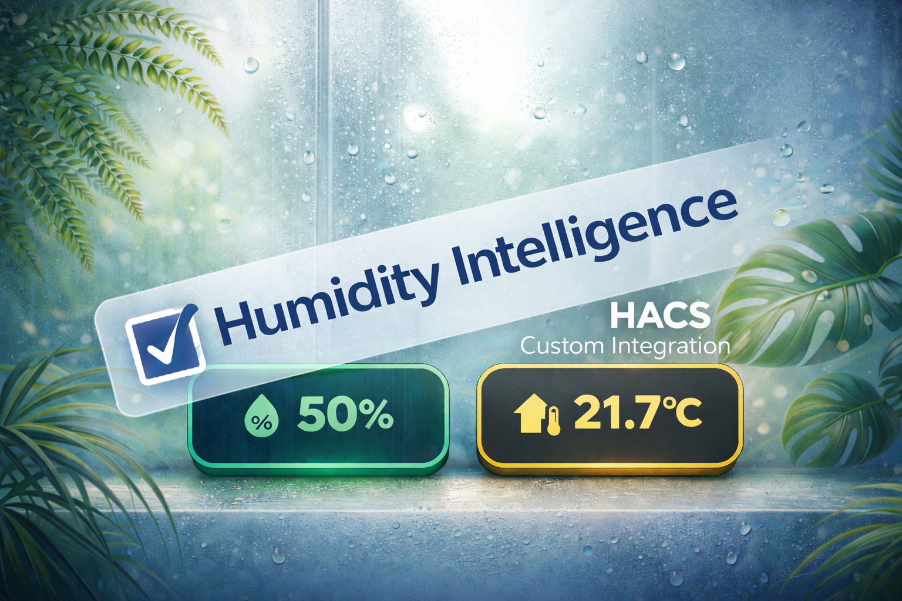

# Humidity Intelligence – v2 integration

## Deterministic Environmental Control for Home Assistant


[](https://github.com/senyo888/Humidity-Intelligence/releases)
[](https://hacs.xyz)
[](https://www.home-assistant.io/)
[](LICENSE)

---

## Contents

- [What Humidity Intelligence V2 Is](#what-humidity-intelligence-v2-is)
- [Why Environmental Stability Matters](#why-environmental-stability-matters)
- [Architecture Overview](#architecture-overview)
- [Installation](#installation)
- [Migration Guide - v1 to v2](#migration-guide---v1-to-v2)
- [Full Configuration Flow](#full-configuration-flow)
- [Configuration Screenshots (Visual Guide)](#configuration-screenshots-visual-guide)
- [Post-Configuration Workflow](#post-configuration-workflow)
- [How to Use Services](#how-to-use-services)
- [Design Philosophy](#design-philosophy)

---

## What Humidity Intelligence V2 Is

Humidity Intelligence V2 is not a collection of automations.

It is a **deterministic environmental runtime engine**.

It replaces stacked triggers and conflicting scripts with:

- a lane-based priority architecture
- physics-aware environmental modelling
- global gating logic
- one authoritative control state per evaluation cycle

There is no "last automation wins."
There is no trigger race condition.
There is one resolved outcome, every time.

This is environmental control with structure.

---

## Why Environmental Stability Matters

Most dashboards show a number.
Humidity Intelligence models behavior.

Humidity problems rarely appear as isolated spikes.
They emerge as:

- drift
- imbalance
- duration
- recurring spread patterns

### High Humidity Related Issues


- condensation formation
- mould growth risk
- dust mite proliferation
- sleep disruption
- structural degradation over time

### Low Humidity Related Issues

- irritated airways
- dry throat and coughing
- worsened asthma symptoms
- dry skin and eye irritation
- reduced respiratory resilience

### Indoor Plant Health Problems

- low humidity: leaf browning, stress, slowed growth
- excess humidity: fungal growth and pest vulnerability

Most homes oscillate between both extremes seasonally.

V2 models that instability structurally.

---

## Architecture Overview

Humidity Intelligence V2 operates across three defined layers.

### 1) Intelligence Layer - Environmental Physics

Transforms raw telemetry into structured environmental signals:

- dynamic house average humidity
- 7-day mean and drift tracking
- Magnus dew point calculation
- condensation spread (`temperature - dew_point`)
- mould risk normalization
- worst-room detection
- binary danger states

This layer models risk
and does not control hardware.

### 2) Control Layer - Deterministic Priority Engine

Canonical runtime order:

1. CO Emergency: highest priority automation
2. Alert Lane: best use is for when physical intervention is required
3. Zone 1: level humidity stabilisation automation
4. Zone 2: lower priority humidity level stabilisation automation
5. Air Quality: background automation with VOC PM25 & IAQ threshold triggers.
6. Normal

Humidifier lanes operate independently where safe.

Each evaluation cycle:

1. global gates evaluated
2. lanes resolved top-down
3. first valid lane wins
4. lower lanes remain blocked

Only one comfort/control lane drives outputs at a time.

This eliminates automation conflict entirely.

### 3) Presentation Layer - UI Truth Contract

The UI reflects runtime truth:

- active lane
- gate blocks
- override state
- reason text
- output stage transparency

The UI does not compute logic.
The engine decides.
The UI renders.

---

## Installation

### Option A - HACS (Recommended)

1. Add custom repository:
   `https://github.com/senyo888/Humidity-Intelligence`
   Category: Integration
2. Install **Humidity Intelligence**
3. Restart Home Assistant
4. Go to Settings -> Devices & Services -> Add Integration
5. Search for **Humidity Intelligence**
6. Begin configuration


---

## Migration Guide - v1 to v2

V1 was template-based.
V2 is a structured integration with configuration flow and runtime validation.

Migration is required.

### Step 1 - Remove v1 Backend

Delete:

```text
/config/custom_templates/humidity_intelligence.jinja
/config/packages/humidity_intelligence.yaml
```

Remove any related includes from `configuration.yaml`.
Restart Home Assistant.

### Step 2 - Remove v1 UI YAML

Delete:

```text
/config/www/.../v1_mobile.yaml
/config/lovelace/v1_mobile.yaml
```

Restart if using YAML dashboards.

### v1 UI Compatibility

The classic four-badge + Comfort Band layout remains compatible on the V2 engine.

- V1 UI = presentation skin
- V2 = runtime engine

No forced visual migration.

---

## Full Configuration Flow

Follow this sequence on first install.

### 1) Dependencies

What to do:
- review optional frontend dependencies
- continue even if some are not installed

Suggested baseline:
- install HACS first
- install card helpers used by your chosen dashboard style
- if unsure, continue with skip and complete backend setup first


### 2) Global Gates

What to do:
- set time gate window (optional)
- select presence/alarm entities (optional)
- define explicit present and away state values

Example baseline:
- time gate enabled: `06:00` to `23:30`
- outside action: `safe_state`
- presence entities: `person.adam`, `person.eve`, or alarm panel
- present states: `home`, `on`, `disarmed`
- away states: `not_home`, `off`, `armed_away`, `away`

Example:
- if everyone is away, HI enters gate hold
- Current Air Control shows gate-active mode/chips
- outputs are held or reset based on selected outside action

### 3) Telemetry Inputs

What to do:
- add source entities for humidity and temperature
- add optional AQ telemetry (`iaq`, `pm25`, `voc`, `co2`, `co`) 
- added sensors will appear in the UI Chip
- assign EVERY sensor to level and room regardless of intended use

Rules:
- minimum one humidity + one temperature sensor per active level
- use `level1` and `level2` consistently
- keep room labels stable and human-readable

Example baseline:
- Level 1: kitchen humidity, hallway humidity, kitchen temperature
- Level 2: bedroom humidity, landing humidity, bedroom temperature
- AQ: one IAQ + one PM2.5 per level if available

Example row:
- entity: `sensor.kitchen_humidity`
- type: `humidity`
- level: `level1`
- room: `Kitchen`

### 4) Temperature Slope Mode

What to do:
- choose external slope sensors or HI-generated slope

Suggested baseline:
- use HI-generated slope if you do not already publish stable slope entities
- use external slope entities only when they are already validated

Example (external):
- `sensor.kitchen_temp_slope`
- `sensor.bedroom_temp_slope`

Example (HI-generated):
- source sensors selected: `sensor.kitchen_temp`, `sensor.bedroom_temp`
- slope calculated displayed and used 

### 5) Zones (Zone 1 and Zone 2)

What to do:
- assign each zone to a level and room set
- configure output entities
- choose triggers and thresholds
- set output stage and UI label

Example baseline:
- Zone 1 label: `Cooking`
- Zone 1 level: `level1`
- Zone 1 output level: `66`
- Zone 1 trigger: humidity delta high
- Zone 2 label: `Bathroom`
- zone 2 trigger: humidity delta high, temp slope delta...
- Zone 2 level: `level2`
- Zone 2 output level: `100`

Example:
- Zone 1 outputs: `fan.kitchen_air`, `fan.living_room_air`
- Zone 2 outputs: `fan.upstairs_air`
- fan stages: `auto`, `33`, `66`, `100`

### 6) Humidifiers

What to do:
- configure per-level humidifier outputs
- confirm on/off behavior against target band

Suggested baseline:
- enable humidifier lanes only on levels with real humidifier hardware
- validate activation below target low
- validate recovery shutoff inside the normal band

Example:
- Level 1 output: `humidifier.downstairs_humidifier`
- turns on when below low target
- turns off when humidity recovers to low target + 3%

### 7) Air Quality

What to do:
- enable AQ per level if AQ telemetry is present
- assign outputs and run duration
- set safe AQ thresholds

Suggested baseline:
- AQ output level: `66`
- run duration: `15` to `30` minutes
- IAQ threshold aligned to your sensor scale and household tolerance

Example:
- Level 1 AQ output: `fan.purifier_living`
- trigger: IAQ below threshold
- if Zone or Alert lane is active, AQ is deferred
- if two AQ levels share one output, last trigger update wins output setting

### 8) Alerts and CO Emergency

What to do:
- configure alert triggers, outputs, and flash behavior
- configure CO emergency thresholds and outputs

Suggested baseline:
- keep thresholds realistic and bounded
- use dedicated lights for alerts when possible
- use optional `power_entity` when wiring requires separate power enable

Example alert:
- trigger type: custom binary sensor
- trigger entity: `binary_sensor.bathroom_moisture_alert`
- threshold: `80`
- lights: `light.bathroom_alert`
- power entity: `switch.bathroom_light_power` (optional)

Example CO:
- trigger type: CO emergency
- threshold: `15`
- outputs: purifier/fan entities on both levels

### 9) UI Deployment

What to do:
- click finish setup
- select card(s) you would like to generate
- card YAML dropped with notification of location  
- if not generate mapped cards through services


Suggested baseline:
- start with one dashboard layout (`v2_mobile` or `v2_tablet`)
- verify Current Air Control, chips, and outputs
- then add second layout if needed

Service options:
- `humidity_intelligence.create_dashboard`
- `humidity_intelligence.view_cards`
- `humidity_intelligence.dump_cards`

Example service usage:
- create dashboard with `layout: v2_mobile`, `title: Humidity Intelligence`, `url_path: humidity-intelligence`

---

## Configuration Screenshots (Visual Guide)


<details>
<summary>Open configuration screenshots</summary>

### 1) Dependencies
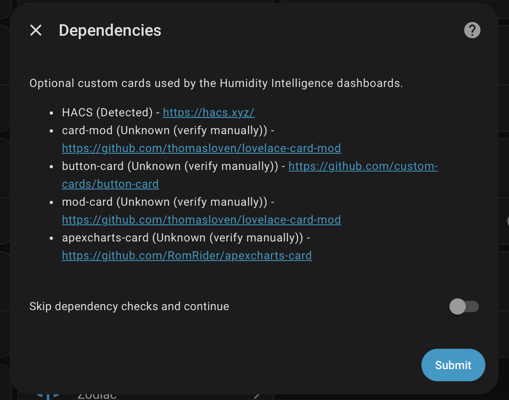

### 2) Global Gates
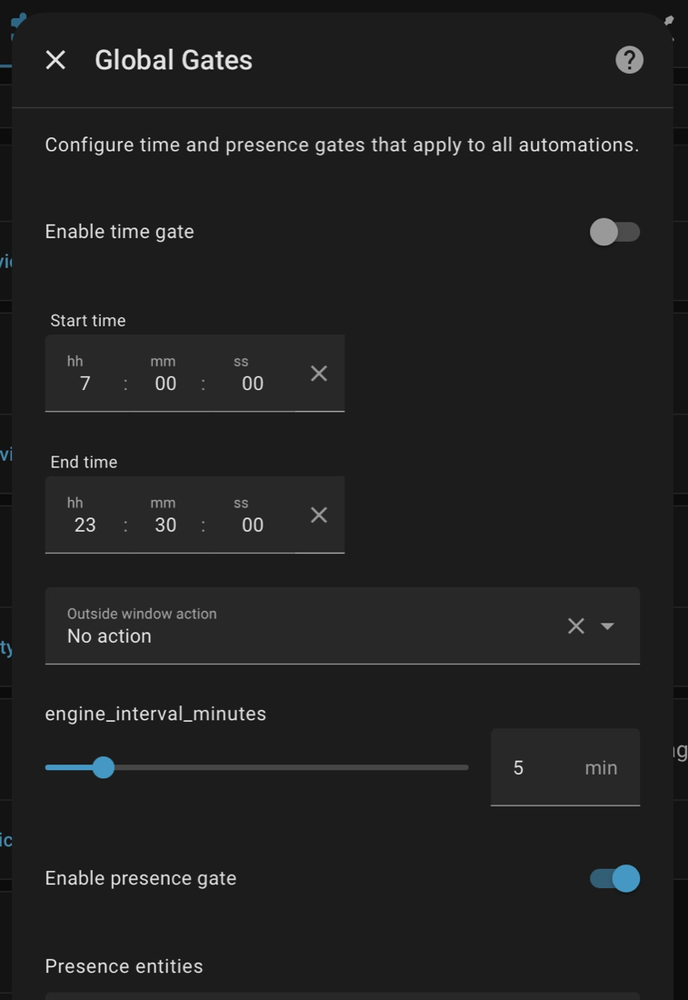
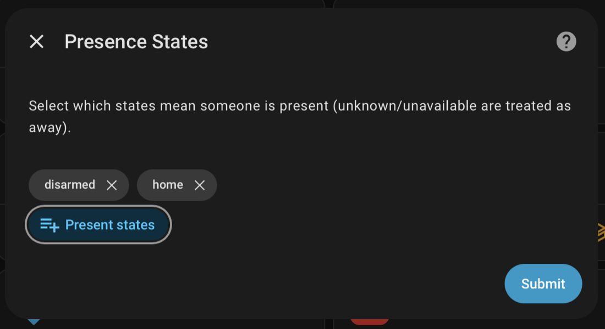

### 3) Telemetry Inputs
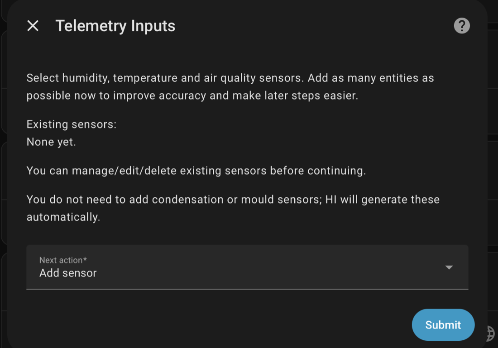
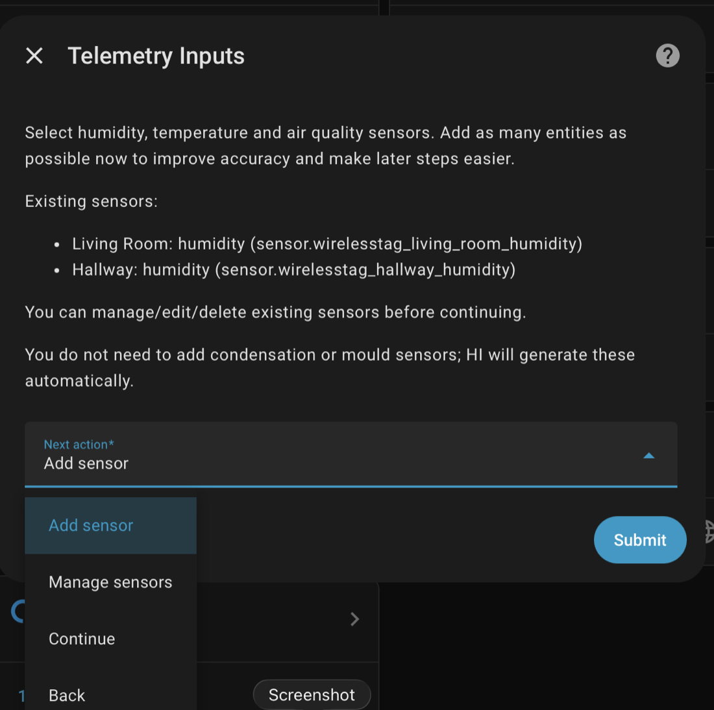

### 4) Zones
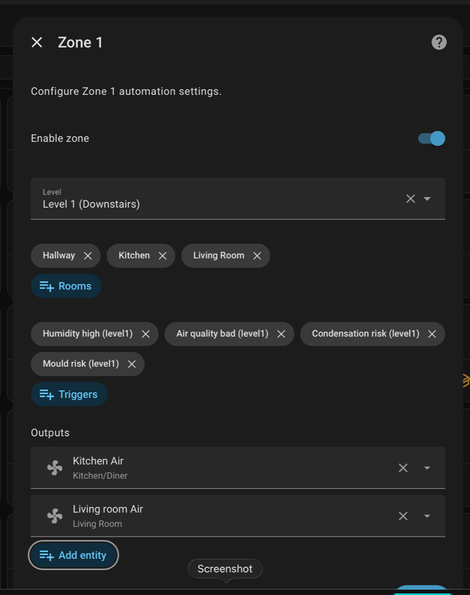
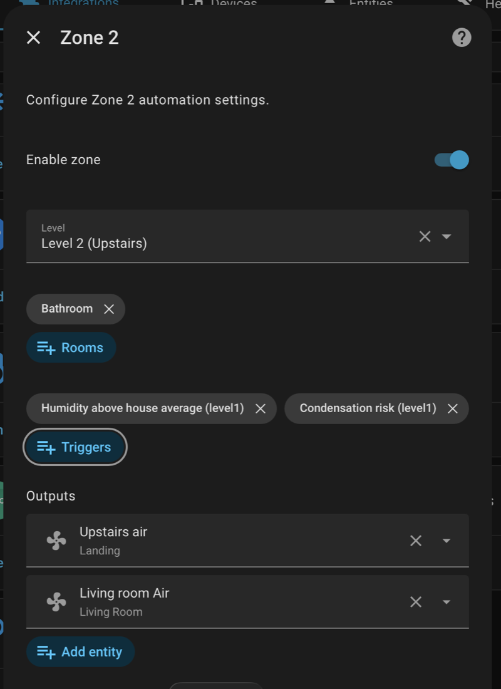
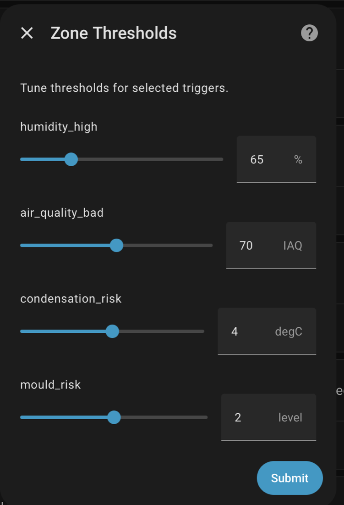

### 5) Humidifiers
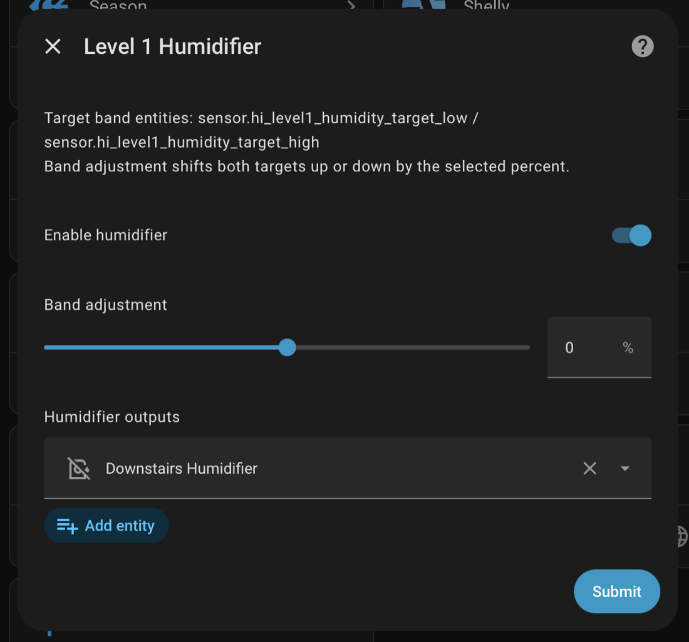

### 6) Air Quality
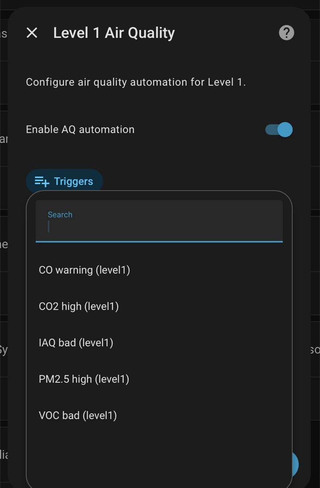
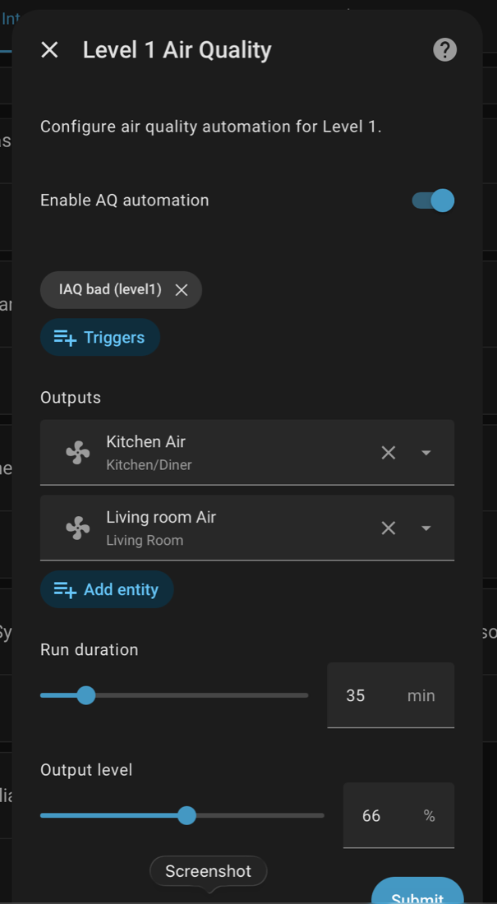

### 7) Alerts
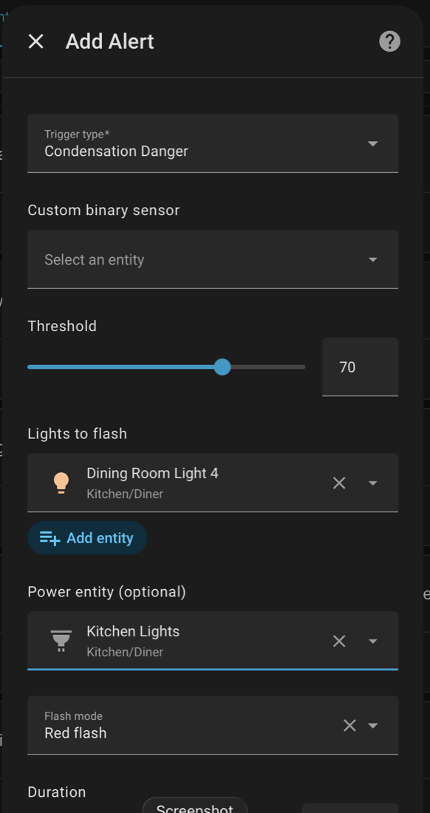

### 8) Sensor Management (Options)
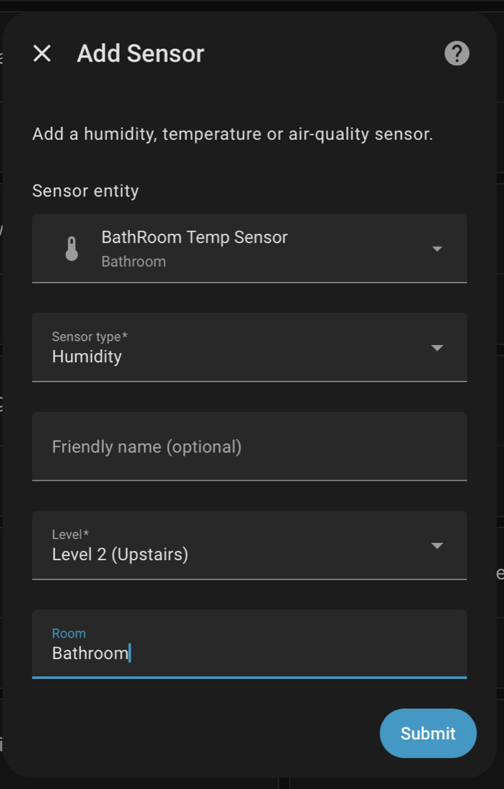

</details>

---

## Post-Configuration Workflow

When modifying options:

1. change one section at a time
2. save
3. run `humidity_intelligence.refresh_ui`
4. verify:
   - Current Air Control mode
   - gate chips
   - reason text
   - output behavior

---

## How to Use Services

Use Home Assistant Developer Tools:
1. Go to **Developer Tools -> Actions**.
2. Select service domain: `humidity_intelligence`.
3. Pick a service.
4. Fill service data (YAML or UI fields).
5. Run and verify result in UI/notifications/files.

Notes:
- `entry_id` is optional for most services. If omitted, HI uses all entries or first valid entry based on service behavior.
- File outputs are written into your HA config folder.

### `create_dashboard`
Purpose:
- create a Lovelace dashboard from a rendered HI layout.

Example:
```yaml
service: humidity_intelligence.create_dashboard
data:
  layout: v2_mobile
  title: Humidity Intelligence
  url_path: humidity-intelligence
```

### `view_cards`
Purpose:
- render cards and write them to file, then push a notification with file path.

Example:
```yaml
service: humidity_intelligence.view_cards
data:
  filename: humidity_intelligence_cards
  layout: v2_tablet
```

### `dump_cards`
Purpose:
- render and export card YAML to file without dashboard creation.

Example:
```yaml
service: humidity_intelligence.dump_cards
data:
  filename: humidity_intelligence_cards
  layout: v2_mobile
```

### `refresh_ui`
Purpose:
- rebuild placeholder mapping and refresh rendered UI output after config changes.

Example:
```yaml
service: humidity_intelligence.refresh_ui
data: {}
```

### `flash_lights`
Purpose:
- run alert flash behavior manually for testing.

Example:
```yaml
service: humidity_intelligence.flash_lights
data:
  power_entity: switch.alert_power
  lights:
    - light.bathroom_alert
  color: [255, 0, 0]
  duration: 12
  flash_count: 8
```

### `pause_control`
Purpose:
- pause automation engine for a set duration.

Example:
```yaml
service: humidity_intelligence.pause_control
data:
  minutes: 60
```

### `resume_control`
Purpose:
- clear pause state and resume runtime immediately.

Example:
```yaml
service: humidity_intelligence.resume_control
data: {}
```

### `self_check`
Purpose:
- run mapping/dependency/telemetry health checks and write report JSON.

Example:
```yaml
service: humidity_intelligence.self_check
data: {}
```

### `dump_diagnostics`
Purpose:
- export runtime diagnostics, mapping, and card info to JSON.

Example:
```yaml
service: humidity_intelligence.dump_diagnostics
data:
  filename: humidity_intelligence_diagnostics.json
```

### `purge_files`
Purpose:
- remove generated HI files and attempt dashboard cleanup.

Example:
```yaml
service: humidity_intelligence.purge_files
data: {}
```

Safety guidance:
- use `purge_files` only when intentionally resetting generated artifacts
- run `dump_diagnostics` before purge if you want a snapshot for troubleshooting

---

## Design Philosophy

- determinism over cleverness
- transparency over magic
- one authoritative state
- explicit override hierarchy
- safe fallback over silent failure

Humidity Intelligence V2 your environmental runtime architecture.

