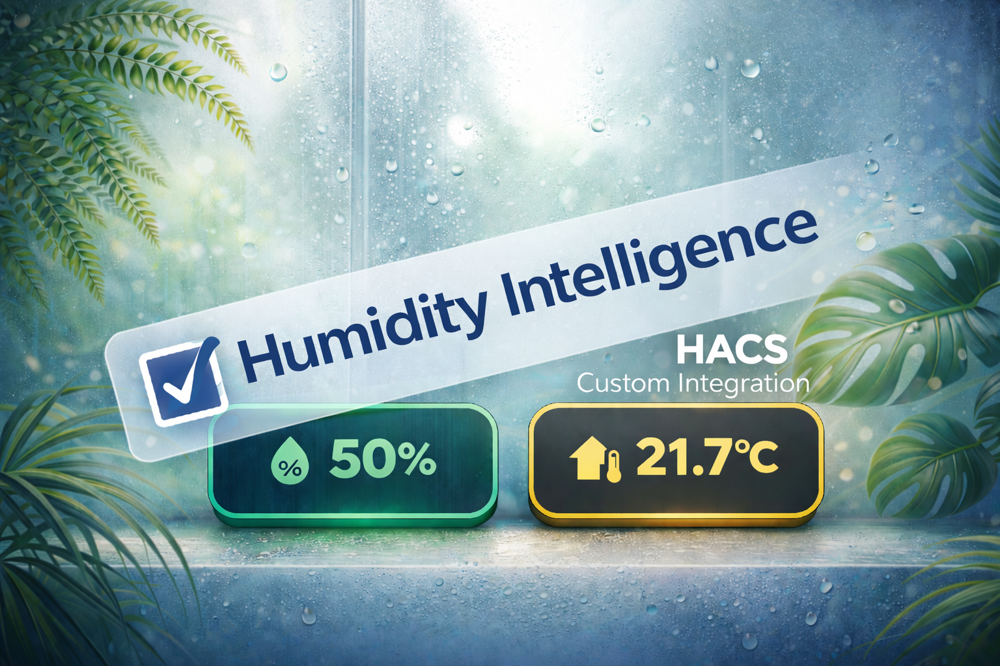
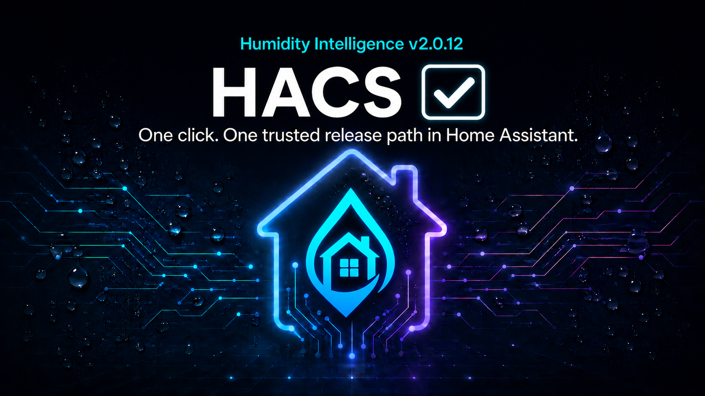

<!-- Logo and Banner -->



# Humidity Intelligence

## Domestic Environmental Stabilisation Engine for Home Assistant

[](https://github.com/senyo888/Humidity-Intelligence/releases)
[](https://senyo888.github.io/humidity-intelligence/)
[](https://my.home-assistant.io/redirect/hacs_repository/?owner=senyo888&repository=humidity-intelligence&category=integration)
[](https://github.com/senyo888/Humidity-Intelligence/blob/main/custom_components/humidity_intelligence/manifest.json)
[](LICENSE)
[](https://github.com/sponsors/senyo888)
[](https://github.com/senyo888/humidity-intelligence)

## Contents

- [TL;DR](#tldr)
- [Project Site and Search Discovery](#project-site-and-search-discovery)
- [Wiki and Support Manual](#wiki-and-support-manual)
- [What Is Humidity Intelligence](#what-is-humidity-intelligence)
- [Support Humidity Intelligence](#support-humidity-intelligence)
- [V2 UI Example](#v2-ui-example)
- [Why Environmental Stability Matters](#why-environmental-stability-matters)
- [Air Quality and Environmental Stability](#air-quality-and-environmental-stability)
- [Season-Aware Environmental Control](#season-aware-environmental-control)
- [Design Philosophy](#design-philosophy)
- [Architecture Overview](#architecture-overview)
- [Public Architecture Contract](#public-architecture-contract)
- [Current Release Highlights](#current-release-highlights)
- [Installation](#installation)
- [Frontend Dependencies](#frontend-dependencies)
- [Migration Guide - v1 to v2](#migration-guide---v1-to-v2)
- [Full Configuration Flow](#full-configuration-flow)
- [UI Gallery](#ui-gallery)
- [Post-Configuration Workflow](#post-configuration-workflow)
- [How to Use Services](#how-to-use-services)
- [Support, Diagnostics, and Issue Triage](#support-diagnostics-and-issue-triage)
- [Runtime Simulation Validation](#runtime-simulation-validation)
- [Release Notes](#release-notes)

---

## TL;DR

Humidity Intelligence is a domestic environmental control engine for Home Assistant. It watches the conditions inside a home, decides which environmental problem needs attention first, and explains that decision in plain Home Assistant entities and dashboard text.

It reads humidity, temperature, air quality, condensation, mould-risk, carbon monoxide (CO), presence, time, pause, and override signals, then resolves **one explainable control decision per evaluation cycle**.

It gives you:

- season-aware humidity targets
- deterministic lane priority
- safe degraded behavior when inputs are missing
- exported Lovelace Manual-card YAML backed by runtime truth
- native Home Assistant diagnostics for support and triage
- services for dashboard export, self-check, diagnostics, pause/resume, and release validation

The v2.0.12 package includes Manual output handover, Home Assistant local-time gates,
lifecycle-safe timer updates, and child-device Area support. For the latest published
Stable version, see [GitHub Releases](https://github.com/senyo888/Humidity-Intelligence/releases/latest)
and the versions offered in HACS. Humidity Intelligence is included in the HACS
default repository; select **Download** in HACS to install a published version.

---

## Project Site and Search Discovery

Humidity Intelligence now has a lightweight GitHub Pages project site:

- [Open the project site](https://senyo888.github.io/humidity-intelligence/)

The site exists to help Home Assistant users find Humidity Intelligence through
search and quickly understand what the project does. It includes crawl-friendly
metadata, a canonical URL, sitemap/robots files, and structured data for search
engines.

The project site is a project overview. The living support and runtime record stays
here: installation guidance, release notes, migration notes, diagnostics, the Wiki
support manual, GitHub releases, and the canonical `ui-gallery/` files.

---

## Wiki and Support Manual

The Wiki is the practical support manual for setup, services, diagnostics, generated
dashboards, and user-safe release checks. It exists early here so users do not have to
dig through the README before finding the longer guides.

Useful Wiki pages:

- [Home](https://github.com/senyo888/humidity-intelligence/wiki)
- [Configuration Walkthrough](https://github.com/senyo888/humidity-intelligence/wiki/Configuration-Walkthrough)
- [Services Reference](https://github.com/senyo888/humidity-intelligence/wiki/Services-Reference)
- [Generated Dashboards](https://github.com/senyo888/humidity-intelligence/wiki/Generated-Dashboards)
- [UI Gallery](https://github.com/senyo888/humidity-intelligence/wiki/UI-Gallery)
- [Diagnostics and Support Bundle](https://github.com/senyo888/humidity-intelligence/wiki/Diagnostics-and-Support-Bundle)
- [HACS and Updates](https://github.com/senyo888/humidity-intelligence/wiki/HACS-and-Updates)
- [Air Quality and CO Safety](https://github.com/senyo888/humidity-intelligence/wiki/Air-Quality-and-CO-Safety)
- [Troubleshooting Generated UI](https://github.com/senyo888/humidity-intelligence/wiki/Troubleshooting-Generated-UI)
- [Release Validation for Users](https://github.com/senyo888/humidity-intelligence/wiki/Release-Validation-for-Users)
- [Understanding Control Decisions](https://github.com/senyo888/humidity-intelligence/wiki/Understanding-Control-Decisions)
- [Getting Help](https://github.com/senyo888/humidity-intelligence/wiki/Getting-Help)

The Wiki is support guidance. Runtime behavior, entity semantics, service schemas,
generated dashboard logic, migration requirements, and release state stay owned by the
repository source, release notes, GitHub releases, and
`custom_components/humidity_intelligence/manifest.json`.

---

## What Is Humidity Intelligence

Humidity Intelligence is designed to help stabilise the environment inside a home using real sensor telemetry and carefully coordinated smart-home control.

Most Home Assistant dashboards show readings. Humidity Intelligence turns those readings into a single, explainable control decision. It watches humidity, temperature, temperature drift, air quality, condensation risk, mould risk, and seasonal comfort patterns, then uses configured devices to guide the home back toward a more stable state.

Using sensors placed around the property, Humidity Intelligence can intelligently control devices such as:

- air purifiers
- dehumidifiers
- extractor fans
- humidifiers
- ventilation systems
- smart lighting alerts

The system works as a coordinated environmental control layer for everyday household conditions. For example:

- rising bathroom humidity can trigger extractor and ventilation behaviour before condensation settles
- poor air quality from cooking or occupancy can activate configured purification or ventilation zones
- unstable overnight humidity can be corrected gradually to improve comfort and reduce moisture stress
- dangerous conditions such as mould-risk humidity or carbon monoxide escalation can trigger higher-priority safety responses

Certified carbon-monoxide alarms remain the primary detection and alerting system;
Humidity Intelligence provides an additional Home Assistant awareness layer.

Humidity Intelligence is intentionally deterministic. Every decision is based on visible telemetry, defined environmental rules, and priority logic rather than opaque AI behaviour or unpredictable automation chains. The goal is long-term environmental stability, comfort, and property protection rather than automation for its own sake.

The project also places strong emphasis on transparency. Users can see why actions are happening, what environmental conditions triggered them, which zone is active, and what the system is trying to achieve at any given moment. Seasonal context, comfort targets, active alerts, and runtime reasoning are surfaced directly into the UI so the system feels understandable rather than mysterious.

At its core, Humidity Intelligence is about creating a calmer, more stable living environment through continuous environmental awareness and accountable smart-home control.

## Support Humidity Intelligence

### Enjoying Humidity Intelligence?

If you're finding Humidity Intelligence useful, insightful, or just interesting to explore, consider giving the repository a star.

It helps others discover the project, supports ongoing development, and shows that this kind of deterministic, explainable approach to Home Assistant has community value.

[⭐ Star Humidity Intelligence on GitHub](https://github.com/senyo888/Humidity-Intelligence)

Optional sponsorship is also available through GitHub Sponsors:

[Support the project on GitHub Sponsors](https://github.com/sponsors/senyo888)

Sponsorship is optional and separate from support SLAs, private support obligations,
feature guarantees, release commitments, and Home Assistant / HACS behavior.

---

<details>
<summary><h2>V2 UI Example</h2></summary>

These are live `2.0.10-beta.7` dashboard captures. Home Assistant was restarted, the
beta.7 cards were freshly exported, the complete Manual-card YAML was replaced, and
the dashboard/browser cache was refreshed before capture.

<p align="center">
  
  
</p>

<p align="center"><em>Live package-and-card UI evidence, not soak, Stable, release, or HACS-publication evidence.</em></p>

### The simple reason

The comparison graphics below are editorial illustrations built from the refreshed
beta.7 UI evidence. They explain the reason-field presentation change; they are not
continuous playback records.


<details>
<summary><strong>More UI Examples</strong></summary>

Additional screenshots and layout comparisons live in the Wiki so the front page stays focused.

- [Browse the UI Gallery](https://github.com/senyo888/humidity-intelligence/wiki/UI-Gallery)
- [Open the canonical gallery source](ui-gallery/README.md)

</details>

</details>

<details>
<summary><h2>Why Environmental Stability Matters</h2></summary>

Homes rarely become damp, dry, stale, or uncomfortable because of one isolated reading. Problems usually build as patterns: a bathroom that stays wet too long, a bedroom that drifts away from the rest of the house, a winter profile that needs a lower humidity target, or an air-quality spike that lingers after cooking.

Humidity Intelligence is built for those patterns. It treats environmental stability as the goal rather than a single perfect number.

The important signal goes beyond "humidity is high" or "humidity is low." It is the shape of the problem:

- drift
- imbalance
- duration
- recurring spread patterns

That is where environmental control becomes more personal. A house can look fine in the daytime, then become uncomfortable in the evening when real life happens: dinner is cooked, showers run, baths are taken, laundry dries, doors close, bedrooms cool, and every person in the home keeps adding moisture simply by breathing. By the time everyone is trying to sleep, the air can feel heavier, bedding can feel clammy, windows can start to mist, and the room can feel unstable even if the dashboard is only showing a number.

High humidity can make sleep feel broken and heavy. It can also help condensation settle on cold surfaces, support mould and dust-mite conditions, damage finishes, and stress timber or other moisture-sensitive materials over repeated cycles.

Low humidity is quieter, but it can still be uncomfortable. Dry winter air can mean irritated airways, dry throat, coughing, itchy skin, gritty eyes, and natural materials that shrink, creak, or crack as they repeatedly dry out.

Humidity Intelligence is designed for that domestic rhythm. It can see rooms rising or falling away from the active seasonal target, explain the condition, and use configured ventilation, dehumidification, or humidification before short-lived discomfort becomes repeated instability.

For the fuller explanation, including property impact, health comfort, sleep, night-time humidity sources, dry-air effects, plant health, and research context, see the Wiki guide: [Why Environmental Stability Matters](https://github.com/senyo888/humidity-intelligence/wiki/Why-Environmental-Stability-Matters).

</details>

<details>
<summary><h2>Air Quality and Environmental Stability</h2></summary>

Humidity Intelligence is broader than humidity alone. It contributes to environmental stability by surfacing indoor air-quality signals from configured Home Assistant entities and, where users have configured suitable outputs, using available devices such as air purifiers or ventilation fans to respond to poor air-quality conditions.

Air-quality support is telemetry-driven. Humidity Intelligence reflects configured sensors, entities, thresholds, and output devices; the UI and reason panel stay aligned with backend/entity truth.

The wider air-quality (AQ) telemetry family in the current configuration flow includes indoor air quality (IAQ), fine particulate matter (PM2.5), volatile organic compounds (VOCs), carbon dioxide (CO2), and carbon monoxide (CO), depending on what the user configures.

Where an AQ lane is configured, it remains below safety and moisture-risk alert lanes in the deterministic priority order. Carbon monoxide emergency handling remains the highest-priority runtime lane, while normal AQ responses are deferred when higher-priority alert or zone lanes are active.

Carbon-monoxide safety deserves primary, certified protection. Humidity Intelligence can reflect configured CO telemetry as an additional Home Assistant awareness layer, while certified carbon-monoxide alarms remain the primary detection and alerting system.

Detailed AQ and CO guidance lives in the support manual:

- [Air Quality and CO Safety](https://github.com/senyo888/humidity-intelligence/wiki/Air-Quality-and-CO-Safety)
- [Understanding Control Decisions](https://github.com/senyo888/humidity-intelligence/wiki/Understanding-Control-Decisions)

</details>

<details>
<summary><h2>Season-Aware Environmental Control</h2></summary>

`56%` can mean different things.

The same humidity reading can mean different things in January and July. A home that feels stable in summer may be too damp for a cold winter envelope, while an aggressive winter target may be unnecessarily dry in warmer months.

Humidity Intelligence evaluates humidity **relative to the active target profile**:

- Winter defaults to a lower comfort band than summer
- Spring and autumn use intermediate bands
- Custom target profiles are supported when configured

Interpretation now follows target-relative states:

- `below_target` -> dry for the active profile
- `in_target` -> stable band for the active profile
- `above_target` -> elevated for the active profile
- `high_risk` -> materially above the active profile's safe limit

This keeps stability as the primary goal while making evaluation season-correct and explainable.

Temperature comfort uses the same source-of-truth approach for display, so dashboard colours and chips follow backend comfort sensors rather than card-only assumptions:

- Automatic mode resolves the active seasonal comfort band and warm boundary
- Custom mode allows a fixed lower/upper comfort band and derives the warm boundary as custom high + `1.0°C`
- Temperature chips use HI comfort sensors, not card-only thresholds

Default temperature comfort bands:

- Winter: blue below `20°C`, green `20-21°C`, yellow `21-21.5°C`, red above `21.5°C`
- Spring: blue below `20.5°C`, green `20.5-22°C`, yellow `22-23.5°C`, red above `23.5°C`
- Summer: blue below `21°C`, green `21-24°C`, yellow `24-26.5°C`, red above `26.5°C`
- Autumn: blue below `20°C`, green `20-21.5°C`, yellow `21.5-23°C`, red above `23°C`

</details>

<details>
<summary><h2>Design Philosophy</h2></summary>

Humidity Intelligence is built around a simple premise: a home works better with one visible environmental controller than with a loose pile of automations competing for control. That controller should read configured telemetry, apply a stable priority hierarchy, and resolve one explainable outcome per evaluation cycle.

The engine is deterministic by design. It avoids guesses and hidden preferences. It evaluates season-aware humidity targets, safety gates, alert conditions, zone demand, air quality state, and humidifier needs through explicit rules so runtime behavior can be inspected, predicted, and explained.

The UI is a truth surface. Current Air Control, chips, diagnostics, and exported cards reflect backend telemetry, entity mappings, runtime mode, and degraded-state reasons. If an input is missing or an output is unavailable, Humidity Intelligence shows that condition and falls back safely without pretending the home is stable.

The architectural preference is calm regulation over automation chaos:

- one selected ventilation lane per evaluation cycle
- CO emergency and alert hierarchy before comfort correction
- humidifier lanes kept independent from ventilation resolution
- global gates and overrides visible when they suppress control
- exported Manual-card YAML aligned with backend truth only
- safe degraded behavior before blind output writes

The result should feel steady in a domestic environment: readable, conservative, and accountable when conditions change.

</details>

<details>
<summary><h2>Architecture Overview</h2></summary>

Humidity Intelligence operates across three defined layers. Each layer has a clear job: turn readings into meaning, decide which lane has authority, and show the result without inventing extra logic.

### 1) Intelligence Layer - Environmental Physics

This layer turns raw telemetry into structured environmental signals:

- dynamic house average humidity
- 7-day mean and drift tracking, using the canonical `sensor.house_humidity_mean_7d` statistics dependency
- Magnus dew point calculation
- condensation spread (`temperature - dew_point`)
- mould risk normalization
- worst-room detection
- binary danger states

This layer models risk. Control happens in the deterministic priority engine.

### 2) Control Layer - Deterministic Priority Engine

This layer decides which single lane gets control authority during the current evaluation cycle.

Canonical runtime order:

1. CO Emergency: highest-priority safety lane
2. Humidity Danger
3. Mould Danger
4. Mould Risk
5. Condensation Danger
6. Condensation Risk
7. Zone 1
8. Zone 2
9. Air Quality
10. Normal

Alert lanes resolve the originating sensor to a configured room/zone, then use that zone's boost fan level as the single deterministic control path. Once an actionable alert is selected, HI holds that boost path until the originating alert clears unless a higher-priority alert appears.

If an alert candidate cannot be mapped to a safe zone output, HI skips blind boosts. The reason panel reports the unmapped/degraded alert and automation continues to the next eligible priority.

Built-in humidity, mould, and condensation risk states are treated as alert candidates when they can be traced back to telemetry. This keeps zone boost behavior and the companion alert chip aligned even if a matching explicit alert row has not been added.

Humidity Danger alerts follow the active target profile's high-risk threshold at runtime. Legacy saved humidity threshold values are ignored for that alert type, so seasonal/custom profile changes immediately affect alert evaluation.

Custom trigger entities and custom binary sensors are not part of the alert flow. Optional alert configuration is for enabling HI alert handling and adding visual indicator rules only; the alert source remains HI's deterministic intelligence layer.

Boost settings should normally be higher than the standard zone fan level. Zone control handles normal correction; boost is reserved for danger escalation such as condensation, mould risk, or humidity danger.

Humidifier lanes operate independently where safe.

Manual override hands ordinary output ownership to the user or external automation.
HI cancels pending non-CO control work and leaves existing fan, switch, humidifier,
and visual-alert output states unchanged. Its mode and reason surfaces report that
handover directly, while humidifier diagnostics retain observed state as
`manual_hold` without claiming HI selected it. CO emergency remains the only
exception and can still force its configured ventilation outputs to 100%. Turning
Manual off triggers a fresh deterministic evaluation and restores normal AUTO
ownership. This does not add temporary manual operation while AUTO remains enabled.

Humidifier demand and output truth are intentionally separate. The existing
downstairs/upstairs humidifier-active helpers mean HI is requesting humidification
after global, pause, presence/time, telemetry, manual-override, and alert gates have
been applied. Humidifier-output isolation is evaluated after demand, so testing can
show truthful requested demand while suppressing service calls.

For each configured `humidifier`, `fan`, or `switch` output, HI compares aggregated
lane demand with the Home Assistant-observed state. An off output during active
demand receives one immediate turn-on request and at most two delayed retries; an
output still mismatched after the final confirmation window is fault-latched instead
of being hammered. Output state events request coalesced reevaluation, and the normal
engine interval is the periodic safety net. Shared outputs use OR ownership, so one
lane recovering cannot turn off an output still demanded by another lane.

Using a blocking Home Assistant service call would only wait for the service handler;
it would not confirm device actuation or moisture output. HI therefore keeps dispatch
non-blocking and establishes truth from later observed state with bounded retries.

`NORMAL` remains a valid ventilation mode while humidifier demand is active: it means
no ventilation lane won the deterministic ventilation hierarchy. V2 chips report
humidifier Requested, On, Idle, Isolated, Retrying, Stopping, Unknown, Degraded, or
Fault truth; reason text and diagnostics retain the full backend reconciliation
detail. Chip label `On` is the concise presentation of backend `output_on`. A generic
output `on` state—and any optional vendor/platform action attribute—is Home Assistant
evidence only and does not prove physical moisture production.

Each evaluation cycle:

1. global gates evaluated
2. lanes resolved top-down
3. first valid lane wins
4. lower lanes remain blocked

Only one comfort/control lane drives outputs at a time.

This keeps control ownership explicit and prevents lower-priority comfort responses from fighting safety or risk responses.

### 3) Presentation Layer - Clear, Truthful Status

This layer explains what HI is doing:

- the selected ventilation response
- any gate, pause, or override limiting control
- the reason for the decision
- humidifier demand and the output state Home Assistant can observe

HI decides; the cards explain that decision.

The Air Control Reason entity supplies the final wording shown by V2 cards. The cards
display that backend-authored text instead of rebuilding control logic in the
dashboard. When the text is missing or the card uses an older format, it falls back to
the existing reason and ultimately shows `Reason unavailable.` Older cards and
existing integrations can continue using the original reason state and supporting
details. The technical format and fallback rules are documented in
[ARCHITECTURE.md](ARCHITECTURE.md#ui-truth-contract).

The selected ventilation response, humidifier demand, and output seen by Home
Assistant are reported separately. A humidifier chip labelled `Requested` confirms
demand only. HI reports separately whether it sent a command and whether Home
Assistant sees the output as on. Entity state alone leaves physical moisture
unverified. If information is missing or unmatched in the setup, the UI shows
`Unknown`, `Unavailable`, or `Degraded` instead of an all-clear.

Red control-row styling is reserved for a selected alert or CO response. Other
environmental warnings remain visible in the reason text without being presented as
the active control response.

</details>

<details>
<summary><h2>Public Architecture Contract</h2></summary>

The tracked public architecture contract lives in [ARCHITECTURE.md](ARCHITECTURE.md).
It records the durable runtime, UI-truth, Home Assistant compatibility, and release
authority rules used for public review.

Maintainer-only planning notes may exist locally, but public contributor correctness
must be reviewable from tracked repository files.

</details>

<details>
<summary><h2>Current Release Highlights</h2></summary>

- the `2.0.12` maintenance update uses Home Assistant local time for the
  configured time gate and gives HI timer entities lifecycle-owned, at-most-once-per-
  minute countdown updates without changing their IDs or `active`/`idle` states; it
  also aligns setup assistance with Home Assistant 2026.9 child-device Area inheritance
  and releases ordinary fan, switch, humidifier, and visual-alert ownership while
  Manual override is active, with a clearer reason-field explanation and CO emergency
  retained as the sole exception
- the published `2.0.11` Stable release restores the established centred, passive
  Stability preview badge and six-second breathing treatment without calculating a
  score in the card or changing control behaviour
- the published `2.0.10` Stable release adds deterministic humidifier-output
  reconciliation and backend-authored `hi.reason.v1` explanations while preserving
  one selected ventilation lane, the existing lane order, thresholds, configuration,
  stored data, and entity identity
- V2 Mobile, V2 Tablet, and both canonical gallery templates keep ventilation and
  humidifier chips in one horizontally scrollable Current Air Control row;
  `On` and `Requested` are cyan; `Idle`, `Retrying`, `Stopping`, and `Isolated` are
  amber; `Fault` and `Degraded` are red; and `Unknown` is grey
- Humidity Intelligence is included in the HACS default integration repository; the
  official My Home Assistant button below opens this repository in HACS, while GitHub
  Releases and the installed Home Assistant package remain the version records
- the browser-local
  [HI Support Bundle Inspector](https://senyo888.github.io/humidity-intelligence/inspector/)
  provides an optional inspect-before-sharing preflight: diagnostics content stays
  in memory in the browser, with no diagnostic-content upload, analytics, logging,
  or browser storage; only the user-triggered, allowlisted advisory handoff is copied
- diagnostics and release-check report writers now accept only exact lowercase
  `humidity_intelligence_*.json` custom filenames, preserve their existing defaults,
  and write only under `<config>/humidity_intelligence/exports/`
- the fixed self-check report now shares that secure export directory, and generated
  card YAML now writes under `<config>/humidity_intelligence/ui/`; registered
  dashboard YAML remains under `<config>/dashboards/`
- every external `dump_diagnostics`, `self_check`, `v205_release_check`, `dump_cards`,
  and `view_cards` call now requires an authenticated admin user context; trusted
  setup/options/release-check regeneration calls the internal exporter directly,
  while startup refresh remains cache-only
- first-run setup now starts with a welcome/setup-strategy page before Frontend
  Dependencies, so users can save a small initial sensor set and return through
  Options for deeper tuning
- Temperature Slope setup/options now handles collapsed Advanced source lists safely:
  empty submitted source lists fall back to the configured temperature sensors or
  saved source defaults instead of hiding a required-source validation loop
- default generated V2 dashboards lean into status and review: pause/resume and
  standalone View Cards workflows live in explicit service/admin paths, while the
  default runtime card surfaces stay calm and inspection-focused
- the generated V2 Pause LIVE tile is replaced with a passive compact Stability
  preview badge that reads future v2.1 diagnostics when present; score calculation,
  sensor creation, lane selection, and runtime control stay backend-owned. Without
  that future diagnostics contract, the badge shows an intentional neutral-white
  `2.1 / PREVIEW` state with its established breathing shimmer
- the Stability preview and completed-white states use a 10 BPM shimmer cadence:
  one 6-second animation cycle, with reduced-motion preferences respected
- every `pause_control` / `resume_control` call now requires admin user context;
  `entry_id` still limits the action to the supplied config entry
- explicit `create_dashboard` and `purge_files` service calls require admin user
  context. `create_dashboard` is retained as a compatibility-only guidance action and
  performs no file or dashboard writes; purge previews and removes only owned files,
  never Home Assistant dashboards
- the V1 Mobile skin remains available through the v2.0.9 line but is deprecated for
  new dashboards; its dynamic room/risk/profile HTML is escaped, and V2 Mobile is the
  recommended replacement ahead of a separately reviewed v2.1 removal
- native diagnostics and support-oriented exports now favor sanitized structure,
  counts, statuses, and summaries instead of raw entity maps, state dumps, room
  names, or Lovelace resource URLs; validation reports may still include configured
  or generated entity IDs needed to debug missing mappings
- mapped runtime entity diagnostics are aggregated into availability counts; native
  diagnostics and `dump_diagnostics` do not retain mapping keys or mapped entity IDs
- local issue-triage private report writing is confined through the private atomic
  writer, keeping public issue/support flows separate from local report output
- the tracked secret scan now fails closed when no tracked files are selected
- `v205_release_check` preserves its service name; the v2.0.12 update
  extends its generated-card, humidifier-reconciliation, and release-validation
  contract through the v2.0.12 beta/rc/stable line
- Home Assistant Area/Label setup assistance can suggest defaults from registry
  metadata, but saved HI telemetry, zone, AQ, humidifier, and alert mappings remain
  the only runtime truth
- release-prep service usage: run `self_check` or `v205_release_check` for support
  validation. For releases that change generated-card bytes, use `refresh_ui` to
  rebuild the rendered in-memory cache, then `dump_cards` or `view_cards` to write
  fresh YAML and replace the already-pasted static Manual cards. v2.0.12 leaves
  generated-card bytes unchanged, so no Manual-card re-export or replacement is required
- runtime contract: deterministic lane ordering, output-writer boundaries, entity
  semantics, migration shape, and UI truth stay aligned with the existing backend
  model

v2.0.12 update note:

After installing a new HI version through HACS or replacing its files:

1. Restart Home Assistant. A full restart loads the updated HI package and services.
2. Confirm the [loader identity fields](docs/release-governance.md#candidate-registration-evidence)
   report the expected HI version, the entry is loaded, and entities/services are available.
3. Run `humidity_intelligence.v205_release_check` and review the generated report.
4. Check an ordinary configured time-gate window and a timer start/cancel cycle.

The exact final v2.0.12 package registered after one completed restart in the
validated beta.4-to-Stable update. A second restart was not needed. The two-restart
beta procedure remains candidate-validation guidance, not a permanent Stable rule.

No Manual-card re-export is required for v2.0.12 because generated-card bytes are
unchanged. If your installed version differs from the expected HACS version, resolve
that package mismatch before treating runtime or diagnostics evidence as current.

The exported YAML belongs inside a Manual card. Keep registered and YAML-mode
dashboard files as they are; add a Manual card or replace the complete YAML inside an
existing HI Manual card.

In v2.0.10, HI writes the full reason message and the card displays it. Alert messages
state Risk or Danger early, mould levels use named ranges, and humidifier explanations
keep the relevant level name when a longer message is split. Existing V2 cards that
already show HI-authored reason text receive wording updates automatically. The
beta.7 single-row layout and cyan `On` / `Requested` styling require a fresh export.
Users keeping V1 Mobile should also re-export and replace that card to receive the
v2.0.9 fix that safely displays dynamic text.

After the updated integration code is loaded, a config-entry reload is enough for
option changes. `refresh_ui` updates HI's live card cache;
`humidity_intelligence.dump_cards` creates fresh YAML you can paste.

</details>

<details>
<summary><h2>Installation</h2></summary>

### Option A - HACS (Recommended)

Requires Home Assistant **2026.5.1** or newer.

[](https://my.home-assistant.io/redirect/hacs_repository/?owner=senyo888&repository=humidity-intelligence&category=integration)

The button opens Humidity Intelligence in HACS; it does not install automatically.
Select **Download** in HACS, then continue with the restart and integration setup
steps below.

The repository uses the conventional HACS integration layout under
`custom_components/humidity_intelligence/`. HACS installs that package directory only;
repository documentation, tests, scripts, site files, legacy material, and UI Gallery
examples are not included in the Home Assistant integration payload.

1. Open HACS in Home Assistant.
2. Search for **Humidity Intelligence**, filtering by **Integration** if needed.
3. Open the repository entry and select **Download**.
4. Restart Home Assistant.
5. Go to **Settings -> Devices & services -> Add integration**.
6. Search for **Humidity Intelligence** and complete setup.

### Option B - Manual package upgrade

Keep rollback copies **outside `custom_components`**. Another directory declaring the
HI domain can interfere with integration discovery. After startup, verify Home
Assistant's loaded integration version and confirm entities and services are available.
Use the [loader identity fields](docs/release-governance.md#candidate-registration-evidence)
in native diagnostics; HI's own disk-backed version field alone is insufficient.

Use the exact contents of `custom_components/humidity_intelligence/` from the chosen
release or candidate and replace the complete existing directory at:

```text
/config/custom_components/humidity_intelligence/
```

Do not copy the repository root into `custom_components`, and do not create a nested
`humidity_intelligence/custom_components/humidity_intelligence` path. The repository
root intentionally contains review-only docs, tests, site sources, workflows, and UI
Gallery examples; it is not the installable payload. The conventional component-root
layout lets HACS, Hassfest, manual installs, and source review validate the same
package without `content_in_root` staging behavior.

Back up the existing component directory, replace it as one coherent package, and
fully restart Home Assistant. A config-entry reload alone cannot load changed Python
or manifest metadata. Existing configuration entries and entities remain in place;
no v2.0.12 data migration is required.

For upgrades from before v2.0.9, external report/card file consumers must move to
the HI-owned directories. See the [v2.0.9 migration notes](CHANGELOG.md#209---2026-07-28);
stored HI data needs no migration.

</details>

<details>
<summary><h2>Frontend Dependencies</h2></summary>

Humidity Intelligence runs fully at the backend level. The richer dashboard experience depends on a small set of frontend cards.

You can complete setup without them, but if you want the **full visual system (badges, charts, reason panel, mobile/tablet layouts)**, these are strongly recommended.

### Core Recommendation

Install via HACS before anything else.

### Frontend Dependencies (UI Layer)

The following projects power the visual layer of Humidity Intelligence:

- [card-mod](https://github.com/thomasloven/lovelace-card-mod)
  Advanced styling engine used for dynamic visuals, glow states, and conditional UI rendering.
- [button-card](https://github.com/custom-cards/button-card)
  Core building block for badges, status indicators, and interactive UI elements.
- [mod-card](https://github.com/thomasloven/lovelace-card-mod)
  Structural wrapper used to apply styling cleanly across complex card layouts.
- [apexcharts-card](https://github.com/RomRider/apexcharts-card)
  Powers historical graphs, trend analysis, and environmental visualisation.

### Installation Notes

- All frontend dependencies can be installed via HACS (**Frontend** section).
- After installing, hard refresh your browser or use a new session to avoid caching issues.
- If you skip these, the system still runs, but UI elements may not render correctly.

### Acknowledgements

Huge respect and thanks to the creators of these projects. Humidity Intelligence builds on top of their work:

- **Thomas Loven** for card-mod and mod-card
- **Custom Cards Community** for button-card
- **RomRider** for apexcharts-card

These tools are foundational to the Home Assistant ecosystem and give the dashboard layer its polish.

### Suggested Setup Approach

If you are unsure:

1. Install HACS
2. Install the frontend dependencies above
3. Continue with the configuration flow

Or:

- Skip for now
- Complete backend setup first
- Add the UI layer afterwards

### Configuration Method

Recommended: staged setup. Add a small core sensor set first, complete setup,
save the integration, then return through Options to add the remaining sensors,
rooms, zones, air-quality inputs, humidifiers, alerts, and dashboard exports.
This gives you a saved baseline before the configuration grows.

Advanced: full setup. If your sensor layout is already mapped, add every sensor
during first setup and continue through the whole flow in one pass.

</details>

<details>
<summary><h2>Migration Guide - v1 to v2</h2></summary>

V1 was template-based.
V2 is a structured integration with configuration flow and runtime validation.

Migration is required.

---

### Important - HACS Repository Type Change

V1 was installed as a **Template** in HACS.
V2 is a **Custom Integration**.

If you skip this step, HACS may continue installing files to:

```text
/config/custom_templates/
```

This will break updates and prevent V2 from loading correctly.

### Step 0 - Remove V1 from HACS (Required)

1. Go to **HACS -> Humidity Intelligence**
2. Open the menu (three dots)
3. Click **Remove**
4. Restart Home Assistant

### Step 0.1 - Re-add Repository as Integration

1. Go to **HACS -> Menu -> Custom repositories**
2. Add:

   ```text
   https://github.com/senyo888/Humidity-Intelligence
   ```

3. Set category to:

   ```text
   Integration
   ```

4. Install **Humidity Intelligence**
5. Restart Home Assistant

Correct install path should now be:

```text
/config/custom_components/humidity_intelligence/
```

---

### Step 1 - Remove v1 Backend

Delete:

```text
/config/custom_templates/humidity_intelligence.jinja
/config/packages/humidity_intelligence.yaml
```

Remove any related includes from `configuration.yaml`.
Restart Home Assistant.

### House Humidity Drift 7d

V2 preserves the existing drift meaning:

```text
HI House Humidity Drift 7d = current HI house average humidity - sensor.house_humidity_mean_7d
```

V1 created `sensor.house_humidity_mean_7d` with Home Assistant's Statistics helper. Clean V2 installs need the same helper unless it already exists.

Create or verify the Statistics helper:

- Name: `House Humidity Mean 7d`
- Source entity: the actual registered `HI House Average Humidity` entity
- State characteristic: `mean`
- Max age: `7 days`
- Entity ID: `sensor.house_humidity_mean_7d`

```yaml
sensor:
  - platform: statistics
    name: "House Humidity Mean 7d"
    entity_id: <actual registered HI House Average Humidity entity>
    state_characteristic: mean
    max_age:
      days: 7
```

Since v2.0.6, HI reports missing-helper guidance through the drift sensor attributes, diagnostics, `self_check`, `v205_release_check`, and Home Assistant Repairs. The setup/options Frontend Dependencies pages remain frontend-only; drift helper truth belongs on diagnostics and repair surfaces.

Do not fabricate history. If the helper is missing, warming up, unavailable, or not
numeric, HI reports it as not ready or unavailable instead of synthesizing a drift
value.

If the helper exists but reports `unknown`, `unavailable`, a non-numeric state, low `age_coverage_ratio`, or `source_value_valid: false`, HI treats the helper as still warming up or awaiting usable recorder data.

Let Home Assistant build real history. Drift becomes numeric automatically once the helper has enough recorder/statistics samples for a usable 7-day mean.

### Step 2 - Remove v1 UI YAML

Delete:

```text
/config/www/.../v1_mobile.yaml
/config/lovelace/v1_mobile.yaml
```

Restart if using YAML dashboards.

This cleanup step applies only to the retired pre-integration V1 files listed above.
It does not remove the V2-generated `v1_mobile` compatibility skin described below.

### v1 UI Compatibility And Deprecation

The classic four-badge + Comfort Band layout remains compatible on the V2 engine
through the v2.0.9 line, but it is deprecated for new dashboards. Use V2 Mobile for
new installs. V1 Mobile removal is proposed for v2.1 and requires a separate approved
migration; it is not removed by v2.0.9.

- V1 UI = presentation skin
- V2 = runtime engine

Classic visual layouts remain available during v2.0.9. Re-export and re-copy the V1
card after updating so existing pasted dashboards receive the dynamic-text HTML
escaping fix.

### Post-Migration Check

After install, verify:

- Integration loads in **Settings -> Devices & Services**
- `/custom_templates/` references are gone
- UI renders correctly

If needed, refresh UI:

```yaml
service: humidity_intelligence.refresh_ui
```

### Summary

- V1 = Template system (`custom_templates`)
- V2 = Integration (`custom_components`)
- HACS must be reconfigured to recognise the new structure

This keeps HACS updates, install location, and integration loading aligned with the V2 package layout.

</details>

<details>
<summary><h2>Full Configuration Flow</h2></summary>

First install follows a staged setup path. Essentials stay visible first; expert controls sit inside live **Show advanced tuning** sections so normal setup stays approachable.

Setup shape:

1. Welcome and setup strategy
2. Frontend Dependencies
3. Global Gates
4. Telemetry Inputs
5. Temperature Slope
6. Zones
7. Humidifiers
8. Air Quality
9. Alerts and CO Emergency
10. UI Deployment

Key setup guidance:

- add humidity and temperature telemetry for active levels
- use the first-run welcome page as the high-level setup strategy: save the smallest
  useful initial sensor set, then return through Options for detailed tuning
- assign telemetry to stable, readable rooms and levels
- review any Home Assistant Area/Label setup suggestions before saving them as
  explicit HI room or level values; Area and Label metadata is advisory only
- let HI calculate Temperature Slope from configured temperature sensors unless you
  already have trusted slope entities; if the collapsed Advanced source list submits
  empty, HI falls back to the configured/saved temperature sources instead of
  inventing a hidden source or re-rendering a confusing validation error
- optionally set Level 1 / Level 2 display labels from Zones before Zone 1 / Zone 2 setup; labels are display-only and fall back to `Level 1` / `Level 2`
- keep zone labels and output mappings clear enough for reason text and diagnostics
- use recommended thresholds first, then tune from options after observing behavior
- keep AQ and CO telemetry grounded in configured Home Assistant entities
- use zone boost levels for alert escalation where alerts resolve to a mapped zone
- use the generated dashboard export after setup or option changes

The default first UI export is `v2_tablet`. `show_output_entity_details` is display-only and controls whether generated cards include the expandable output details panel.
Level display labels are also display-only. Changing them updates generated-card/config-flow/support text after options are saved and cards are refreshed. Entity IDs, helpers, levels, zones, outputs, and runtime lanes keep their existing identities.

Home Assistant Area and Label setup assistance is read-only. HI may suggest room or
level defaults from registry metadata, and diagnostics may report sanitized mismatch
counts, but runtime control keeps using saved HI telemetry, zone, AQ, humidifier, and
alert mappings.

Detailed manual:

- [Configuration Walkthrough](https://github.com/senyo888/humidity-intelligence/wiki/Configuration-Walkthrough)
- [Air Quality and CO Safety](https://github.com/senyo888/humidity-intelligence/wiki/Air-Quality-and-CO-Safety)
- [Generated Dashboards](https://github.com/senyo888/humidity-intelligence/wiki/Generated-Dashboards)

</details>

<details>
<summary><h2>UI Gallery</h2></summary>

The browseable UI Gallery lives in the Wiki:

- [UI Gallery](https://github.com/senyo888/humidity-intelligence/wiki/UI-Gallery)

Canonical YAML, preview assets, and contribution rules remain versioned in this repository:

- [Gallery source](ui-gallery/README.md)
- [Default V2 Mobile AQ](ui-gallery/default-v2-mobile-aq/README.md)
- [Default V2 Tablet Zone 1 Cooking](ui-gallery/default-v2-tablet-zone-1-cooking/README.md)
- [Default V1 Mobile (deprecated)](ui-gallery/default-v1-mobile/README.md)
- [Contributing UI Gallery examples](ui-gallery/CONTRIBUTING.md)

The Wiki is a visual navigation layer. Repository files remain the source of truth
for dashboard YAML, generated-card compatibility, entity semantics, and contribution
review.

For new gallery submissions, open a repository pull request. Do not treat Wiki-only
YAML as canonical install guidance.

</details>

<details>
<summary><h2>Post-Configuration Workflow</h2></summary>

When modifying options:

1. change one section at a time
2. save
3. run `humidity_intelligence.refresh_ui` or export cards where the current release guidance calls for it
4. verify Current Air Control mode, gate chips, reason text, and output behavior

Common post-configuration areas:

- `Sensors`: add, edit, or delete telemetry rows; Area/Label suggestions are
  advisory defaults only and become HI truth only if saved into explicit fields
- `Global Gates`: edit time, presence, alert-only, and target-profile behavior
- `Zones`: edit display-only Level 1 / Level 2 labels before Zone 1 / Zone 2 configuration
- `Thresholds & Comfort`: review comfort mode and zone thresholds
- `Humidifiers`: add or edit per-level humidifier lanes
- `Air Quality`: add or edit AQ lanes, triggers, outputs, and thresholds
- generated UI: run `humidity_intelligence.dump_cards` and paste refreshed YAML into existing Manual cards when card visibility, template, backend entity mapping, or generated-card options change

Detailed manual:

- [Configuration Walkthrough](https://github.com/senyo888/humidity-intelligence/wiki/Configuration-Walkthrough)
- [Generated Dashboards](https://github.com/senyo888/humidity-intelligence/wiki/Generated-Dashboards)
- [Troubleshooting Generated UI](https://github.com/senyo888/humidity-intelligence/wiki/Troubleshooting-Generated-UI)

</details>

<details>
<summary><h2>How to Use Services</h2></summary>

Use Home Assistant Developer Tools:
1. Go to **Developer Tools -> Actions**.
2. Select service domain: `humidity_intelligence`.
3. Pick a service.
4. Fill service data (YAML or UI fields).
5. Run and verify result in UI/notifications/files.

Notes:
- `entry_id` is optional for most services. If omitted, HI uses all entries or first valid entry based on service behavior.
- `dump_diagnostics`, `self_check`, and `v205_release_check` JSON is written under
  `<config>/humidity_intelligence/exports/`. Generated card YAML is written under
  `<config>/humidity_intelligence/ui/`. These exports are Manual-card fragments, not
  complete dashboard YAML, and must not be copied into `<config>/dashboards/`.
- Single-entry card exports retain unqualified names such as
  `humidity_intelligence_cards_v2_mobile.yaml`. Multi-entry installations add an
  entry-qualified token before the layout to prevent one entry overwriting another.
  Adding a second entry re-exports all loaded entries with qualified names; removing
  back to one re-exports the remaining entry with unqualified names. HI no longer
  refreshes superseded owned-UI names, but external consumers can still read their
  stale content. Follow the latest notification rather than inferring a path.
- Default generated V2 cards are read-only status surfaces. Runtime-changing actions
  such as pause/resume and file cleanup belong in Home Assistant service/admin
  workflows. Dashboard creation and editing remain in Home Assistant's dashboard UI.
  System and Manual buttons keep the
  v2.0.7 helper-toggle behavior.
- The generated V2 control row uses a passive Stability preview badge instead of
  a Pause LIVE control tile. It reflects future v2.1 diagnostics when available
  while score calculation, lane selection, and runtime control stay backend-owned.
  Without that future contract, the badge shows `2.1 / PREVIEW` with the established
  neutral-white breathing shimmer, paced at a slow 10 BPM—one pulse every 6 seconds.
  A dedicated preview class keeps that presentation distinct from a completed
  backend score.
- Every `pause_control` / `resume_control` call requires an admin user context.
  Supplying `entry_id` scopes the action to that config entry; it does not bypass the
  authorization check. Background automations/scripts whose action context has no
  `user_id` are intentionally rejected, even when configured by an admin. Invoke
  these services from an authenticated admin UI or API session.
- Explicit `create_dashboard` and `purge_files` calls require an admin user context.
  `create_dashboard` remains registered for call compatibility but fails safely with
  `refresh_ui`, `view_cards`, and Manual-card guidance before mapping, rendering,
  filesystem access, or Lovelace imports. First-run setup exports selected cards and
  does not create or register a dashboard. Older stored `create_dashboard` selections
  are ignored without migration or retry loops.
- Every external `dump_diagnostics`, `self_check`, `v205_release_check`, `dump_cards`,
  and `view_cards` call also requires an admin user context. Contextless background
  automations/scripts cannot invoke these writers; use an authenticated admin UI,
  REST, or WebSocket session. There is no YAML option that manufactures an admin
  context for a background automation. HI-owned setup/options and release-check
  test-card regeneration remains available through the trusted internal exporter;
  startup refresh remains cache-only.
- Every external `flash_lights`, `create_local_backup`, and `list_saved_versions`
  call requires an admin user context and rejects background automations/scripts
  without a `user_id` before light, snapshot, or inventory work begins.
  `list_saved_versions` remains read-only but is gated because its notification
  exposes package-local snapshot metadata. Runtime-owned visual alerts use a separate
  trusted internal helper after the engine selects an alert lane, so this permission
  boundary does not change deterministic lane resolution or active-alert continuity.
- `purge_files` validates the complete fixed HI-generated file set, posts the exact
  existing-file preview with a blocking notification, then deletes. Any file deletion
  failure is surfaced as an incomplete purge instead of being silently treated as
  success. Home Assistant dashboards are user-managed and are never listed or removed,
  even when legacy config-entry data contains `ui_dashboard_id`. An `entry_id`-scoped purge does not remove
  report exports. Only an unscoped all-entry purge may remove the exact default
  diagnostics and fixed self-check reports. Exact default/per-entry card and
  release-test card exports are purge-owned. Custom card
  exports, custom reports, release-check reports, and all legacy config-root JSON/YAML
  remain retained.
- Config-entry removal separately removes that entry's exact default/release-test card
  exports, but does not remove Home Assistant dashboards, reports, custom card exports,
  or legacy root files. When a multi-entry installation returns to one entry, the
  remaining entry is re-exported with unqualified names; its superseded qualified
  files stay externally readable until an exact previewed purge.
- `v205_release_check` is the backward-compatible validation service name. It accepts
  the v2.0.5-v2.0.12 beta/rc/stable line and is runtime/device
  read-only: it writes its validation report, and `write_test_exports: true`
  additionally writes card-export test files.
- `dump_diagnostics` and native diagnostics are support surfaces; support exports are
  sanitized for public/private boundary safety where possible, but
  `self_check` / `v205_release_check` validation reports may include entity IDs
  needed for mapping support. Treat those validation reports as local/private until
  reviewed or sanitized before public sharing.
- Custom filenames for `dump_diagnostics` and `v205_release_check` must use the
  exact lowercase `humidity_intelligence_*.json` pattern. The defaults are
  unchanged. JSON report services now write under
  `<config>/humidity_intelligence/exports/`; existing root-level reports are not
  moved, copied, or deleted. Generated card consumers must similarly move from the
  config-root filename to `<config>/humidity_intelligence/ui/<filename>`. HI does not
  dual-write, copy, symlink, move, or delete legacy root JSON/YAML, so verify a fresh
  owned-directory artifact before updating file sensors, shell commands, scripts, or
  support tools; then disable the stale root consumer explicitly. Update callers that
  supply another custom report filename. Fully restart Home
  Assistant after installing this package update; a config-entry reload alone does
  not load the changed service code or schema. Concurrent writes are serialized
  inside HI and each replacement is atomic; the last atomic replacement wins, but
  callers must not rely on invocation order.

- Rollback restores the complete prior integration package and any backed-up consumer
  paths, followed by a full Home Assistant restart. Files already written under
  `<config>/humidity_intelligence/exports/` or
  `<config>/humidity_intelligence/ui/` remain in place and are not moved back to the
  config root. Reverting package code alone does not refresh a legacy root artifact;
  consumers must be deliberately pointed at the restored path.

Common service groups:

| Service | Use |
| --- | --- |
| `dump_cards` | admin-only export of generated card YAML for static Manual dashboards |
| `refresh_ui` | rebuild placeholder mappings and refresh cached rendered UI output |
| `view_cards` | admin-only render/export plus an exact file-path notification |
| `create_dashboard` | compatibility-only admin action that performs no writes and returns supported Manual-card setup guidance |
| `flash_lights` | admin-only test of configured visual alert behavior; runtime alerts use the trusted engine path |
| `pause_control` / `resume_control` | admin-only pause or resume for one supplied entry or all entries |
| `self_check` | admin-only fixed export of mapping, generated-card entity, telemetry, drift-helper, and frontend-dependency checks |
| `v205_release_check` | admin-only runtime-safe v2.0.5-v2.0.12 generated-card, humidifier-reconciliation, and release-validation support checks |
| `create_local_backup` | admin-only creation of a package-local HI snapshot for advanced validation |
| `list_saved_versions` | admin-only, read-only inspection of package-local HI snapshot metadata |
| `dump_diagnostics` | admin-only export of fuller local diagnostics for maintainer/debug workflows |
| `purge_files` | admin-only, previewed removal of fixed generated HI artifacts with partial-failure reporting |

Example card export:

```yaml
service: humidity_intelligence.dump_cards
data:
  filename: humidity_intelligence_cards
  layout: v2_mobile
```

Example release validation export:

```yaml
service: humidity_intelligence.v205_release_check
data:
  filename: humidity_intelligence_v205_release_check.json
```

### Finding A Newly Dumped Card

Existing users should expect the location to change in v2.0.9:

- `dump_cards` writes under `<config>/humidity_intelligence/ui/` but does not post a
  completion path notification. Open that directory in File Editor after the action.
- `view_cards` writes the selected layout to the same directory and posts the exact
  path in a persistent notification. Use it when file discovery is the priority.
- first-run and relevant options regeneration also post every exact written path.
- `refresh_ui` only rebuilds the rendered in-memory cache; it does not write YAML.

For a single-entry installation using the default basename, a mobile export is
`<config>/humidity_intelligence/ui/humidity_intelligence_cards_v2_mobile.yaml`.
Multi-entry installations insert an entry-qualified token, and custom basenames
produce different filenames. Always use the path reported by `view_cards` or the
setup/options notification when either applies.

If File Editor was already open, refresh its file tree or reopen it after export. If
the file still does not appear, confirm that the action was run from an authenticated
admin UI/API session and check the Home Assistant log for an export error. There is
no config-root fallback.

An older file such as
`<config>/humidity_intelligence_cards_v2_mobile.yaml` is retained for migration
safety but is no longer refreshed. A newer modification time on that legacy file does
not prove that v2.0.9 wrote it; do not copy it after upgrading.

### Manually Removing Files Purge Intentionally Retains

`purge_files` deliberately leaves legacy config-root JSON/YAML, custom card exports,
custom reports, and release-check reports in place. Remove one manually only after
confirming that no file sensor, shell command, script, support tool, or other consumer
still uses it:

1. Generate and validate the replacement in
   `<config>/humidity_intelligence/exports/` or
   `<config>/humidity_intelligence/ui/`.
2. Back up the exact consumer definition and any artifact that must be retained.
3. Update or disable the old consumer, then verify it no longer reads the retained
   path.
4. In File Editor, Studio Code Server, Samba, or SSH, delete only the exact regular
   file you have identified. Do not delete either owned directory, use wildcard
   deletion, or follow a symlink/non-regular object.
5. Refresh the file view and confirm that the new owned-directory artifact and active
   Manual card remain correct.

Manage dashboard creation, editing, and deletion through Home Assistant's dashboard
UI. HI does not own or purge registered dashboards, and a legacy `ui_dashboard_id`
value is not evidence of ownership. Never overwrite a dashboard file with an HI
Manual-card export because the export is only a card fragment.
Deleting an unused retained artifact alone does not require a Home Assistant restart.
Changing a consumer may require that consumer's normal reload.

For GitHub support issues, prefer the native Home Assistant diagnostics download from the Humidity Intelligence integration entry. Diagnostics and `dump_diagnostics` exports favor sanitized structure, counts, statuses, and redaction over raw maps or state dumps. `self_check` and release-validation reports can include configured/generated entity IDs needed to debug missing mappings, so treat those exports as local/private until reviewed or sanitized before public sharing. Use `dump_diagnostics` for fuller local maintainer/debug workflows after reviewing the export.

Detailed manual:

- [Services Reference](https://github.com/senyo888/humidity-intelligence/wiki/Services-Reference)
- [Generated Dashboards](https://github.com/senyo888/humidity-intelligence/wiki/Generated-Dashboards)
- [Troubleshooting Generated UI](https://github.com/senyo888/humidity-intelligence/wiki/Troubleshooting-Generated-UI)
- [Diagnostics and Support Bundle](https://github.com/senyo888/humidity-intelligence/wiki/Diagnostics-and-Support-Bundle)
- [Release Validation for Users](https://github.com/senyo888/humidity-intelligence/wiki/Release-Validation-for-Users)

</details>

<details>
<summary><h2>Support, Diagnostics, and Issue Triage</h2></summary>

When reporting a bug or asking for configuration help, attach the native Home Assistant diagnostics file where possible.

Download it from:

```text
Settings -> Devices & services -> Humidity Intelligence -> Download diagnostics
```

Then drag the downloaded file into the GitHub issue.

Diagnostics help maintainers see:

- Humidity Intelligence and Home Assistant versions
- sanitized config entry/options summaries
- configuration counts and selected-entity category/status summaries
- enabled feature areas
- current runtime lane/mode, gate state, output state, and reason availability/truncation
- active alert resolution
- house humidity drift dependency status
- frontend dependency status when Home Assistant exposes Lovelace resources
- generated UI/card summary
- unavailable/unknown configured entities and support warnings

Sensitive keys and values such as tokens, passwords, API keys, webhook URLs,
credential-bearing URLs, location fields, usernames, host/IP/MAC/SSID values,
device IDs, unique IDs, and private entity IDs are redacted. Selected
entity/mapping/room/Area/Label evidence is generally reduced to counts and status
categories, but user-configured display and level labels may remain. Review the
complete file before uploading it to a public issue.

The public [HI Support Bundle Inspector](https://senyo888.github.io/humidity-intelligence/inspector/)
is an optional browser-local preflight for a supported diagnostics file. It can
produce a short, unsigned advisory handoff for the bug-report and configuration-help
forms. Native Home Assistant diagnostics remain the preferred attachment and
repository/Wiki guidance remains support truth. Live runtime evidence, source
correctness and anonymity remain separate assessments. Copying occurs only when the
user activates Copy, and pasting the handoff into GitHub creates normal GitHub issue
retention. Full `dump_diagnostics` exports remain local unless a maintainer explicitly
requests one.

Issue triage works best with diagnostics-first reports. For wider ideas, dashboard suggestions, compatibility requests, documentation improvements, or automation/control suggestions, use the Community Ideas & Proposals issue form. Community comments and reactions are useful interest signals; maintainer review and the proposal/release process carry approval and scheduling authority.

More detail:

- [Getting Help](https://github.com/senyo888/humidity-intelligence/wiki/Getting-Help)
- [Diagnostics and Support Bundle](https://github.com/senyo888/humidity-intelligence/wiki/Diagnostics-and-Support-Bundle)
- [Support and diagnostics](docs/support.md)
- [Issue triage workflow](docs/issue-triage.md)

</details>

<details>
<summary><h2>Runtime Simulation Validation</h2></summary>

Maintainer runtime validation includes a backend-consumed fake telemetry harness
for `HI Air Control Mode` and `HI Air Control Reason` truth. It is test-only:
no Home Assistant helpers, services, dashboards, automations, or fake fan output
writes are created by default.

Run it from the repository root:

```bash
python3 "tests 2/test_air_control_mode_simulation.py"
```

The harness covers normal, telemetry unavailable, zone pressure, AQ pressure,
disabled/manual/global gates, baseline-clear CO telemetry, and explicit opt-in
CO emergency pressure. Details are in
[Runtime Simulation Validation](docs/runtime-simulation-validation.md).

</details>

<details>
<summary><h2>Release Notes</h2></summary>

HA Lab evidence is optional advisory context and does not block promotion, tagging,
or publication. Canonical validation, review and maintainer approval remain authoritative.

<a id="v2012-maintenance-candidate-not-published"></a>

### v2.0.12



These notes describe v2.0.12. [GitHub Releases](https://github.com/senyo888/Humidity-Intelligence/releases/latest)
records published versions; the source manifest identifies this checkout. A branch
merge alone does not establish publication.

- celebrates completed inclusion of Humidity Intelligence in the HACS default
  integration repository; the button opens the repository in HACS and the user still
  selects **Download**
- evaluates configured time-gate wall-clock windows using Home Assistant local time,
  including same-day, overnight, spring-forward, and both autumn-fold cases, without
  changing the existing inclusive window boundaries
- replaces unowned timer sleepers with lifecycle-owned Home Assistant callbacks,
  aware UTC duration arithmetic, invalidation guards, exact expiry, and at-most-once-
  per-minute `remaining` updates; entity IDs and primary `active`/`idle` states remain
  unchanged
- suppresses only pause-timer `active` to `active` countdown events from full engine
  evaluation while preserving immediate evaluation when the pause state changes
- extends the backward-compatible `v205_release_check` accepted manifest range and
  report wording through v2.0.12 beta/rc/stable; its name, schema, admin requirement,
  report path, and runtime/device-read-only side effects remain unchanged
- preserves native diagnostics schema `1`, redaction, aggregate mapping privacy, and
  Inspector compatibility; after restart, native diagnostics report the installed
  manifest version dynamically
- makes Manual override a complete handover of ordinary fan, switch, humidifier, AQ,
  and visual-alert ownership: pending non-CO work is cancelled, physical output states
  are left unchanged, humidifier truth is observed-only `manual_hold`, and bounded
  runtime-control diagnostics report the handover without claiming an HI command; CO
  remains the sole ventilation exception and normal AUTO ownership resumes after
  Manual is released
- presents that Manual handover in one plain-language reason: what Manual means, what
  HI will leave unchanged, who remains in control, how to return to AUTO, and the CO
  emergency exception; runtime behavior and authority boundaries are unchanged
- preserves CO-first canonical lane order, normal non-Manual AUTO ownership,
  humidifier-lane independence, output configuration, stored data, generated-card
  bytes, and Stability behavior
- requires a full Home Assistant restart after package installation; it requires no
  config-entry, entity-registry, stored-data, threshold, lane-order, service-name, or
  dashboard migration, and no Manual-card re-export is required
- advances the RC to Stable metadata through manifest identity, documentation, and
  matching tests only; beta.4 live validation remains evidence for beta.4, not the
  final Stable package
- **Candidate validation:** beta.4 used two complete Home Assistant restarts, with
  startup and registration checked after each. This is a candidate-validation
  procedure. The exact final v2.0.12 package registered after one completed restart
  in the validated beta.4-to-Stable update; a second restart was not needed. See
  [registration evidence](docs/release-governance.md#candidate-registration-evidence).
- follows the [release governance and approval procedure](docs/release-governance.md)
  for package validation, review, promotion, and publication

<a id="v2011--poetic-justice-current-published-stable"></a>

### v2.0.11 — Poetic Justice


[](https://github.com/senyo888/Humidity-Intelligence/releases) [](https://senyo888.github.io/humidity-intelligence/) [](LICENSE) [](https://github.com/sponsors/senyo888) [](https://github.com/senyo888/humidity-intelligence)

- was published on 11 August 2026 as a non-prerelease GitHub Release and immutable tag
  from exact commit `0dd3e68ab9f35608641dc64efc4b2c4bfacb06ce`
- is now available through the existing HACS default integration listing; the later
  HACS inclusion milestone does not alter the published v2.0.11 package bytes or tag
- restores the established centred Stability Score preview across generated V2
  Mobile, V2 Tablet, and both canonical gallery cards by keeping the name's
  button-card grid area as the quoted string `'n'`
- retains the fixed 82px circle, seven LEDs, and neutral-white six-second breathing
  preview when Stability diagnostics are absent; the card remains passive
  and does not calculate or influence a score
- treats an explicitly present but empty or malformed nested `stability_score`
  payload as `NO SCORE`, while preserving explicit collecting/unavailable states and
  existing completed-score colors
- extends the existing `v205_release_check` version-compatibility boundary through
  v2.0.11 without renaming the service or changing its runtime/device-read-only
  validation purpose
- preserves deterministic lane ordering, output behaviour, configuration and stored
  data, entity IDs/states, service names, and generated-card backend truth
- requires a full Home Assistant restart after installing the package because its
  manifest and release-check service code changed. Existing Manual cards require
  `refresh_ui`, a fresh `dump_cards` or `view_cards` export, complete YAML
  replacement, and a frontend refresh if cached
- requires no config-entry, entity-registry, stored-data, threshold, lane-order,
  service-name, or dashboard-registration migration

<a id="v2010-previous-published-stable"></a>

### v2.0.10


[](https://github.com/senyo888/Humidity-Intelligence/releases) [](https://senyo888.github.io/humidity-intelligence/) [](LICENSE) [](https://github.com/sponsors/senyo888) [](https://github.com/senyo888/humidity-intelligence)

- was published on 2026-08-10 as a non-prerelease GitHub Release and tag from exact
  `main` commit `02b0f17291c7996aca793a8807a5830ede768013`; GitHub Releases and HACS
  remain the public release and installed-package records
- adds deterministic reconciliation for configured `humidifier`, `fan`, and `switch`
  humidifier outputs, including observed-state confirmation, bounded retry/fault
  handling, availability recovery, output isolation, and safe shared-output ownership
- adds the backward-compatible `hi.reason.v1` `display_reason` attribute and clearer
  backend-authored cause, action, demand, dispatch, observed-state, gate, alert, and
  degraded explanations while retaining technical state and `full_reason`
- moves the installable package into
  `custom_components/humidity_intelligence/`, removes HACS `content_in_root`, and keeps
  the installed component path unchanged
- places ventilation and humidifier chips on one horizontal Current Air Control row
  across V2 Mobile, V2 Tablet, and both canonical gallery templates: `On` and
  `Requested` are cyan; `Idle`, `Retrying`, `Stopping`, and `Isolated` amber; `Fault`
  and `Degraded` red; and `Unknown` grey
- preserves one deterministic ventilation decision per cycle, canonical lane order,
  thresholds, configuration schema, stored data, entity IDs/states, and service names;
  humidifier output reconciliation and explanatory/diagnostic attributes change
  intentionally
- closes a diagnostics privacy gap found during forward validation by replacing mapped
  runtime entity rows with aggregate availability counts and removing mapping keys
  from `dump_diagnostics`; runtime mappings and control behaviour are unchanged
- retains `create_dashboard` for call compatibility but changes it to a deterministic,
  admin-gated, no-write Manual-card guidance action. Callers relying on automatic
  dashboard creation or removal must use `refresh_ui` plus `dump_cards`/`view_cards`
  and the Home Assistant Manual-card workflow; existing dashboards and legacy IDs are
  retained
- requires a full Home Assistant restart after installing the Python package. Existing
  Manual cards also require `refresh_ui`, a fresh `dump_cards` or `view_cards` export,
  complete YAML replacement, and a frontend refresh if cached
- requires no config-entry, entity-registry, stored-data, threshold, lane-order, or
  service-name migration
- records advisory beta.7 soak evidence for exact campaign
  `P22C-20260808T073919Z-9162eca3`: 9/9 scheduled slots passed with identity verified
  and no failed or missed slots. Private Stable-instance diagnostics also passed for
  the installed beta.7 package; neither evidence class proves that the later stable
  package bytes were installed on that instance

<!-- Canonical release-note structure: keep the current candidate, current Published
Stable, and immediately preceding Published Stable summaries expanded within this
Release Notes disclosure. Move
displaced older summaries into this container as new releases are added. CHANGELOG.md
remains the complete detailed history. -->
<details>
<summary>Previous Releases</summary>

### v2.0.9

- set integration metadata to stable `2.0.9` and aligned the release documentation;
  GitHub Releases and HACS remain the authoritative publication and installed-package
  records
- added the optional browser-local HI Support Bundle Inspector preflight so users
  can inspect supported diagnostics and copy a bounded advisory handoff before
  sharing; diagnostic contents are not uploaded, logged, analyzed remotely, or
  stored by the Inspector
- restricted `dump_diagnostics` and `v205_release_check` custom filenames to the
  exact lowercase `humidity_intelligence_*.json` namespace, preserving both defaults
- moved caller-selectable diagnostics and release-check reports from the config root
  into `<config>/humidity_intelligence/exports/`, without automatically migrating or
  deleting legacy root reports
- moved the fixed `humidity_intelligence_self_check.json` report into the same secure
  exports directory and all generated card YAML into
  `<config>/humidity_intelligence/ui/`; registered dashboards remain under
  `<config>/dashboards/<url_path>.yaml`
- added no-follow, descriptor-relative, same-directory atomic YAML writes, exact
  purge ownership, and entry-qualified filenames for multi-entry installations
- required an authenticated admin user context for every external `dump_diagnostics`,
  `self_check`, `v205_release_check`, `dump_cards`, and `view_cards` call; contextless
  background callers and non-admin users are rejected before work begins, while
  trusted HI setup/options/release-test generation uses the internal exporter and
  startup refresh remains cache-only
- required an authenticated admin user context for every external `flash_lights`,
  `create_local_backup`, and `list_saved_versions` call; non-admin and contextless
  callers are rejected before light, snapshot, or inventory work, while
  `list_saved_versions` remains read-only and engine-owned visual alerts use a
  separate trusted helper after deterministic lane selection
- extended the backward-compatible `v205_release_check` manifest contract through
  the v2.0.9 beta/rc/stable line
- privacy-filtered local issue-triage body summaries before report escaping, removing
  private HA endpoints, credentials, device IDs, local paths, and entity IDs
- admin-gated targeted and all-entry `pause_control` / `resume_control` calls plus
  explicit dashboard creation and generated-file/dashboard purge
- made purge target truth blocking and exact before deletion, with unsafe filesystem
  candidates rejected and partial file/dashboard failures reported
- escaped dynamic HTML in the retained V1 Mobile source/gallery templates and
  deprecated that layout for new dashboards while preserving it through v2.0.9;
  planned removal remains a separate v2.1 proposal
- migration impact: no stored-data migration. Report consumers must move from
  `<config>/<filename>` to `<config>/humidity_intelligence/exports/<filename>`;
  card consumers must move to `<config>/humidity_intelligence/ui/<filename>`. Legacy
  root JSON/YAML remains untouched with no dual-write, copy, symlink, move, or
  automatic deletion. Verify fresh owned-directory output before switching consumers.
  Callers using another custom report filename must rename it. Contextless background
  automations/scripts can no longer invoke the external writer, `flash_lights`,
  `create_local_backup`, or `list_saved_versions` services; use an authenticated
  admin UI or API call. Runtime visual-alert continuity is unchanged because the
  engine uses its trusted internal helper. Any future automated trusted route
  requires separate design approval
- runtime/UI impact: entity semantics, deterministic lane ordering, and output
  selection are unchanged. Generated-card logic and rendered backend-truth semantics
  are unchanged, while export paths and multi-entry filename qualification change.
  V1 users must re-export and re-copy their card to receive the escaped template
- restart impact: fully restart Home Assistant after installing updated package code;
  a config-entry reload alone is insufficient
- recorded advisory HA Lab evidence for package commit `c54e9e1`: full-package backup
  and source/remote hash verification passed, the maintainer completed the restart,
  post-restart diagnostics/service/runtime checks passed, and approved single-entry
  admin write smoke produced valid owned-directory JSON/YAML with expected
  permissions and post-write continuity
- HA Lab did not live-test non-admin rejection, multi-entry naming, purge removal,
  concurrent/fault-injected writes, legacy-root retention, or rendered Lovelace UI;
  those boundaries remain covered by local tests or require separate live evidence

Release details for v2.0.1 through v2.0.8, including legacy migration notes, are maintained in [CHANGELOG.md](CHANGELOG.md).

</details>

</details>
