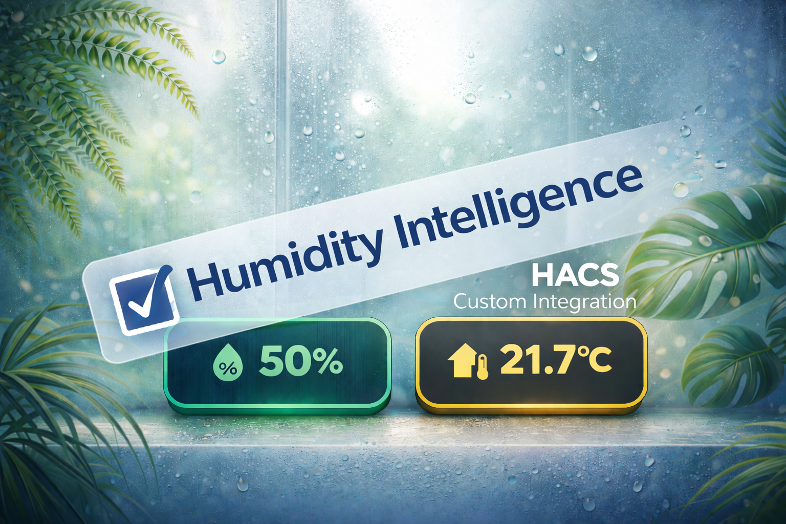
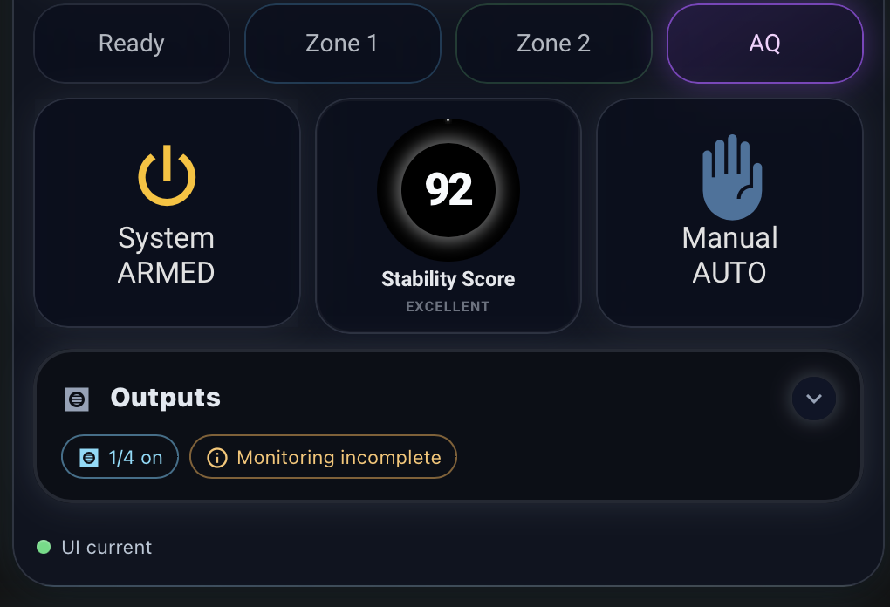
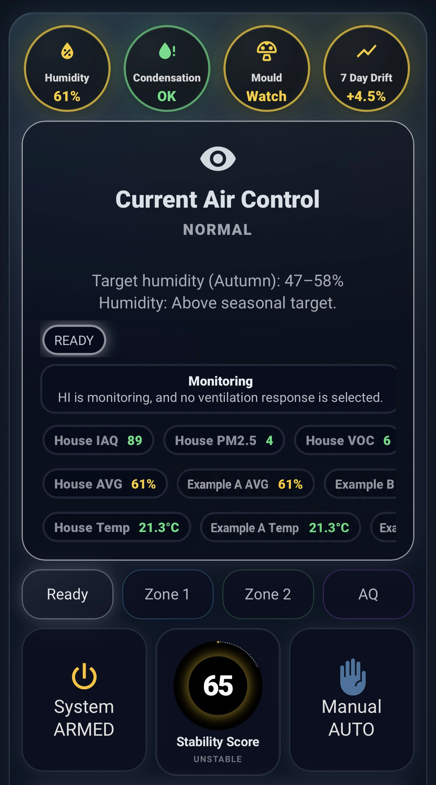
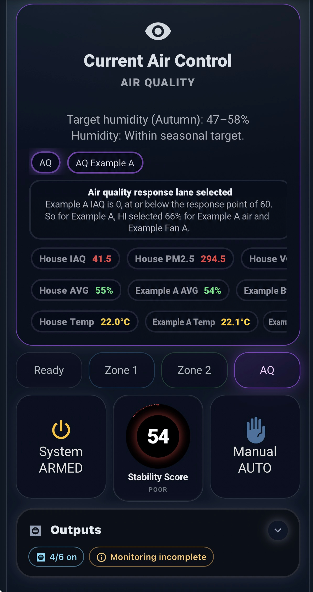
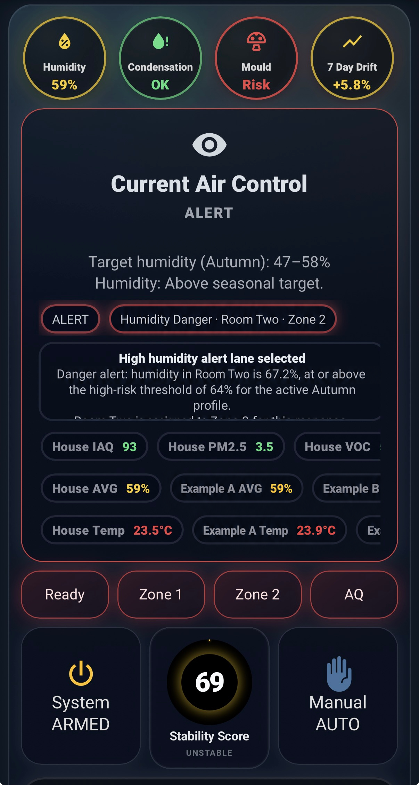
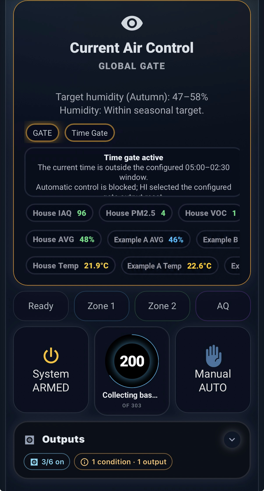
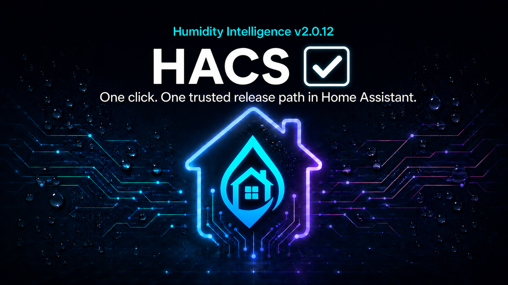

<!-- Logo and Banner -->



# Humidity Intelligence

## Domestic Environmental Stabilisation Engine for Home Assistant

[](https://github.com/senyo888/Humidity-Intelligence/releases)
[](https://senyo888.github.io/humidity-intelligence/)
[](https://my.home-assistant.io/redirect/hacs_repository/?owner=senyo888&repository=humidity-intelligence&category=integration)
[](https://github.com/senyo888/Humidity-Intelligence/blob/main/custom_components/humidity_intelligence/manifest.json)
[](LICENSE)
[](https://github.com/sponsors/senyo888)
[](https://github.com/senyo888/humidity-intelligence)

## Contents

- [TL;DR](#tldr)
- [V2.1 — Stability Score](#v21--stability-score)
- [Project Site and Search Discovery](#project-site-and-search-discovery)
- [Wiki and Support Manual](#wiki-and-support-manual)
- [What Is Humidity Intelligence](#what-is-humidity-intelligence)
- [V2 UI Example](#v2-ui-example)
- [Support Humidity Intelligence](#support-humidity-intelligence)
- [Why Environmental Stability Matters](#why-environmental-stability-matters)
- [Air Quality and Environmental Stability](#air-quality-and-environmental-stability)
- [Season-Aware Environmental Control](#season-aware-environmental-control)
- [Design Philosophy](#design-philosophy)
- [Architecture Overview](#architecture-overview)
- [Public Architecture Contract](#public-architecture-contract)
- [Current Release Highlights](#current-release-highlights)
- [Installation](#installation)
- [Dashboard add-ons](#dashboard-add-ons)
- [Migration Guide - v1 to v2](#migration-guide---v1-to-v2)
- [Full Configuration Flow](#full-configuration-flow)
- [UI Gallery](#ui-gallery)
- [Post-Configuration Workflow](#post-configuration-workflow)
- [How to Use Services](#how-to-use-services)
- [Support, Diagnostics, and Issue Triage](#support-diagnostics-and-issue-triage)
- [Runtime Simulation Validation](#runtime-simulation-validation)
- [Release Notes](#release-notes)

---

## TL;DR

Humidity Intelligence is a domestic environmental control engine for Home Assistant. It watches the conditions inside a home, decides which environmental problem needs attention first, and explains that decision in plain Home Assistant entities and dashboard text.

It reads humidity, temperature, air quality, condensation, mould-risk, carbon monoxide (CO), presence, time, pause, and override signals, then resolves **one explainable control decision per evaluation cycle**.

It gives you:

- season-aware humidity targets
- deterministic lane priority
- safe degraded behavior when inputs are missing
- exported Lovelace Manual-card YAML backed by runtime truth
- native Home Assistant diagnostics for support and triage
- services for dashboard export, self-check, diagnostics, pause/resume, and release validation

Current development manifest version: **v2.1.0-rc.1**, an unpublished candidate.
V2.1 is led by **Stability Score**, with clearer badge explanations and history,
optional output monitoring, reusable monitoring meanings and a simpler status row.
RC.1 retains beta.12 runtime behavior and prepares the approved public content.
HA Stable acceptance and final release validation remain pending.
The current published Stable is **v2.0.12**, released on 9 September 2026 and available
through HACS. See [Release Notes](#release-notes) for candidate scope and upgrade steps.

Optional HA Lab evidence is advisory and does not block promotion, tagging, or
publication.
Canonical tests, review, CI, version governance, and explicit maintainer decisions
remain the release authority.

For publication status, installed packages, and release tags, use
[GitHub Releases](https://github.com/senyo888/Humidity-Intelligence/releases) and
HACS as the user-facing record.


---

## V2.1 — Stability Score

**Stability Score shows how consistently your home has stayed near its environmental
targets over the past 72 hours.** It brings together humidity, steadiness, room
balance, moisture risk, configured air quality and recovery. It observes conditions
without changing HI’s control decisions.

<p align="center">
  <a href="assets/ui/v2.1/stability-score-92.png"></a>
</p>

*Stability Score 92, classified Excellent. Output monitoring remains incomplete,
as shown separately below the score.*

Tap the badge for contributions, individual deductions, their total and the
calculation: **100 − total deductions = calculated score**. The displayed score
also reflects backend rounding and safety ceilings: 64.91 rounds to 65; a ceiling
of 91 does not raise it. Missing evidence can limit or prevent a score.

Hold the existing badge, or Space while focused, to show **Disabled** with a distinct
violet/indigo glow and LEDs; repeat to restore it. Your choice follows your account
and HI entry across sessions. Tap details, calculation, evidence, history and
control continue; no extra switch is needed.

The 72-hour score, recent movement and recorded history describe different things.
The arc compares the current displayed score with an actual reference from within
60 minutes; its colour shows the latest
update. Score history retains ten-minute points and genuine gaps. Restart/reload
starts collection again. The [Stability guide](https://github.com/senyo888/humidity-intelligence/wiki/Stability-Score)
explains coverage, deductions and ceilings; the [calculation contract](docs/stability-score-accepted-baseline.md)
records the exact rules.

Current development includes an opt-in [output observation candidate](docs/output-observation.md). It adds read-only diagnostic context and an optional adaptive Outputs view; it is not part of the published release claim above.
The adaptive Outputs panel uses an HVAC icon and a compact attention summary; full evidence and existing native controls are available on demand.

---

## Project Site and Search Discovery

The [project site](https://senyo888.github.io/humidity-intelligence/) introduces HI
for search and discovery. Installation, configuration, release notes, diagnostics
and runtime guidance remain in this repository and the Wiki; reviewed examples live
in `ui-gallery/`.

---

## Wiki and Support Manual

The Wiki is the practical support manual for setup, services, diagnostics, generated
dashboards, and user-safe release checks. It exists early here so users do not have to
dig through the README before finding the longer guides.

Useful Wiki pages:

- [Home](https://github.com/senyo888/humidity-intelligence/wiki)
- [Configuration Walkthrough](https://github.com/senyo888/humidity-intelligence/wiki/Configuration-Walkthrough)
- [Services Reference](https://github.com/senyo888/humidity-intelligence/wiki/Services-Reference)
- [Generated Dashboards](https://github.com/senyo888/humidity-intelligence/wiki/Generated-Dashboards)
- [UI Gallery](https://github.com/senyo888/humidity-intelligence/wiki/UI-Gallery)
- [Diagnostics and Support Bundle](https://github.com/senyo888/humidity-intelligence/wiki/Diagnostics-and-Support-Bundle)
- [HACS and Updates](https://github.com/senyo888/humidity-intelligence/wiki/HACS-and-Updates)
- [Migration Guide - v1 to v2](https://github.com/senyo888/humidity-intelligence/wiki/Migration-v1-to-v2)
- [Air Quality and CO Safety](https://github.com/senyo888/humidity-intelligence/wiki/Air-Quality-and-CO-Safety)
- [Troubleshooting Generated UI](https://github.com/senyo888/humidity-intelligence/wiki/Troubleshooting-Generated-UI)
- [Release Validation for Users](https://github.com/senyo888/humidity-intelligence/wiki/Release-Validation-for-Users)
- [Understanding Control Decisions](https://github.com/senyo888/humidity-intelligence/wiki/Understanding-Control-Decisions)
- [Getting Help](https://github.com/senyo888/humidity-intelligence/wiki/Getting-Help)

The Wiki is support guidance. Runtime behavior, entity semantics, service schemas,
generated dashboard logic, migration requirements, and release state stay owned by the
repository source, release notes, GitHub releases, and
`custom_components/humidity_intelligence/manifest.json`.

---

## What Is Humidity Intelligence

Humidity Intelligence is designed to help stabilise the environment inside a home using real sensor telemetry and carefully coordinated smart-home control.

Most Home Assistant dashboards show readings. Humidity Intelligence turns those readings into a single, explainable control decision. It watches humidity, temperature, temperature drift, air quality, condensation risk, mould risk, and seasonal comfort patterns, then uses configured devices to guide the home back toward a more stable state.

With configured sensors, Humidity Intelligence can control devices such as:

- air purifiers
- dehumidifiers
- extractor fans
- humidifiers
- ventilation systems
- smart lighting alerts

The system works as a coordinated environmental control layer for everyday household conditions. For example:

- rising bathroom humidity can trigger extractor and ventilation behaviour before condensation settles
- poor air quality from cooking or occupancy can activate configured purification or ventilation zones
- unstable overnight humidity can be corrected gradually to improve comfort and reduce moisture stress
- dangerous conditions such as mould-risk humidity or carbon monoxide escalation can trigger higher-priority safety responses

Humidity Intelligence is intentionally deterministic. Decisions follow visible
telemetry, environmental rules and priority logic. The aim is lasting environmental
stability, comfort and property protection.

You can see why HI is acting, what triggered the response and which zone is active.
Seasonal context, comfort targets, alerts and backend reasons stay visible in the UI.

## V2 UI Example

See the selected response, environmental conditions and reason together in
Current Air Control.

<p align="center">
  
  
</p>

<p align="center"><em>Earlier candidate captures: normal monitoring · air-quality response. The pictured Autumn 47–58% band and earlier badge layout predate the current 50–60% profile.</em></p>

### Conditions and response

The reason panel explains the observed condition, selected response and any
operating gate, so you can see why HI is acting or waiting.

<p align="center">
  
  
</p>

<p align="center"><em>Earlier candidate captures: humidity alert · operating time gate. Captured readings and controls are retained; current targets and card layout may differ.</em></p>

<details>
<summary><strong>More UI Examples</strong></summary>

Browse more operating states and choose a layout in the UI Gallery.

- [Browse the UI Gallery](https://github.com/senyo888/humidity-intelligence/wiki/UI-Gallery)
- [Open the canonical gallery source](ui-gallery/README.md)

</details>

---

## Support Humidity Intelligence

### Enjoying Humidity Intelligence?

If you're finding Humidity Intelligence useful, insightful, or just interesting to explore, consider giving the repository a star.

It helps others discover the project, supports ongoing development, and shows that this kind of deterministic, explainable approach to Home Assistant has community value.

[⭐ Star Humidity Intelligence on GitHub](https://github.com/senyo888/Humidity-Intelligence)

Optional sponsorship is also available through GitHub Sponsors:

[Support the project on GitHub Sponsors](https://github.com/sponsors/senyo888)

Sponsorship is optional and separate from support SLAs, private support obligations,
feature guarantees, release commitments, and Home Assistant / HACS behavior.

---

## Why Environmental Stability Matters

Homes rarely become damp, dry, stale, or uncomfortable because of one isolated reading. Problems usually build as patterns: a bathroom that stays wet too long, a bedroom that drifts away from the rest of the house, a winter profile that needs a lower humidity target, or an air-quality spike that lingers after cooking.

Humidity Intelligence is built for those patterns. It treats environmental stability as the goal rather than a single perfect number.

The important signal goes beyond "humidity is high" or "humidity is low." It is the shape of the problem:

- drift
- imbalance
- duration
- recurring spread patterns

That is where environmental control becomes more personal. A house can look fine in the daytime, then become uncomfortable in the evening when real life happens: dinner is cooked, showers run, baths are taken, laundry dries, doors close, bedrooms cool, and every person in the home keeps adding moisture simply by breathing. By the time everyone is trying to sleep, the air can feel heavier, bedding can feel clammy, windows can start to mist, and the room can feel unstable even if the dashboard is only showing a number.

High humidity can make sleep feel broken and heavy. It can also help condensation settle on cold surfaces, support mould and dust-mite conditions, damage finishes, and stress timber or other moisture-sensitive materials over repeated cycles.

Low humidity is quieter, but it can still be uncomfortable. Dry winter air can mean irritated airways, dry throat, coughing, itchy skin, gritty eyes, and natural materials that shrink, creak, or crack as they repeatedly dry out.

Humidity Intelligence is designed for that domestic rhythm. It can see rooms rising or falling away from the active seasonal target, explain the condition, and use configured ventilation, dehumidification, or humidification before short-lived discomfort becomes repeated instability.

For the fuller explanation, including property impact, health comfort, sleep, night-time humidity sources, dry-air effects, plant health, and research context, see the Wiki guide: [Why Environmental Stability Matters](https://github.com/senyo888/humidity-intelligence/wiki/Why-Environmental-Stability-Matters).

---

## Air Quality and Environmental Stability

Humidity Intelligence is broader than humidity alone. It contributes to environmental stability by surfacing indoor air-quality signals from configured Home Assistant entities and, where users have configured suitable outputs, using available devices such as air purifiers or ventilation fans to respond to poor air-quality conditions.

Air-quality support is telemetry-driven. Humidity Intelligence reflects configured sensors, entities, thresholds, and output devices; the UI and reason panel stay aligned with backend/entity truth.

In V2.1, **Stability Score** puts those conditions in context over 72 hours. It
helps you spot persistent imbalance, repeated moisture risk and slow recovery that
one current reading can miss. Configured air-quality evidence contributes alongside
humidity and moisture-risk evidence; the detail view shows deductions and coverage
so you can see what deserves attention. A high score still leaves individual alerts,
missing evidence and output-monitoring gaps visible. See the
[Stability guide](https://github.com/senyo888/humidity-intelligence/wiki/Stability-Score).

The wider air-quality (AQ) telemetry family in the current configuration flow includes indoor air quality (IAQ), fine particulate matter (PM2.5), volatile organic compounds (VOCs), carbon dioxide (CO2), and carbon monoxide (CO), depending on what the user configures.

Where an AQ lane is configured, it remains below safety and moisture-risk alert lanes in the deterministic priority order. Carbon monoxide emergency handling remains the highest-priority runtime lane, while normal AQ responses are deferred when higher-priority alert or zone lanes are active.

Carbon-monoxide safety deserves primary, certified protection. Humidity Intelligence can reflect configured CO telemetry as an additional Home Assistant awareness layer, while certified carbon-monoxide alarms remain the primary detection and alerting system.

Detailed AQ and CO guidance lives in the support manual:

- [Air Quality and CO Safety](https://github.com/senyo888/humidity-intelligence/wiki/Air-Quality-and-CO-Safety)
- [Understanding Control Decisions](https://github.com/senyo888/humidity-intelligence/wiki/Understanding-Control-Decisions)

---

## Season-Aware Environmental Control

`56%` can mean different things.

The same humidity reading can mean different things in January and July. A home that feels stable in summer may be too damp for a cold winter envelope, while an aggressive winter target may be unnecessarily dry in warmer months.

Humidity Intelligence evaluates humidity **relative to the active target profile**:

- Winter defaults to a lower comfort band than summer
- Spring uses 47–58%; autumn uses 50–60% with a 64% high-risk threshold
- Custom target profiles are supported when configured

Interpretation now follows target-relative states:

- `below_target` -> dry for the active profile
- `in_target` -> stable band for the active profile
- `above_target` -> elevated for the active profile
- `high_risk` -> at or above the active profile's danger threshold

For Autumn, 50–60% is in target; above 60% is above target, and 64% or higher
meets the humidity-danger threshold. These are HI profile boundaries, not universal
safe cutoffs. Custom 50–60% derives a different danger threshold of 67.5%; see
[profile settings](https://github.com/senyo888/humidity-intelligence/wiki/Configuration-Walkthrough#operating-schedule--limits).

Temperature comfort uses the same source-of-truth approach for display, so dashboard colours and chips follow backend comfort sensors rather than card-only assumptions:

- Automatic mode resolves the active seasonal comfort band and warm boundary
- Custom mode allows a fixed lower/upper comfort band and derives the warm boundary as custom high + `1.0°C`
- Temperature chips use HI comfort sensors, not card-only thresholds

Default temperature comfort bands:

- Winter: blue below `20°C`, green `20-21°C`, yellow `21-21.5°C`, red above `21.5°C`
- Spring: blue below `20.5°C`, green `20.5-22°C`, yellow `22-23.5°C`, red above `23.5°C`
- Summer: blue below `21°C`, green `21-24°C`, yellow `24-26.5°C`, red above `26.5°C`
- Autumn: blue below `20°C`, green `20-21.5°C`, yellow `21.5-23°C`, red above `23°C`

---

## Design Philosophy

Humidity Intelligence is built around a simple premise: a home works better with one visible environmental controller than with a loose pile of automations competing for control. That controller should read configured telemetry, apply a stable priority hierarchy, and resolve one explainable outcome per evaluation cycle.

The engine is deterministic by design. It avoids guesses and hidden preferences. It evaluates season-aware humidity targets, safety gates, alert conditions, zone demand, air quality state, and humidifier needs through explicit rules so runtime behavior can be inspected, predicted, and explained.

The UI is a truth surface. Current Air Control, chips, diagnostics, and exported cards reflect backend telemetry, entity mappings, runtime mode, and degraded-state reasons. If an input is missing or an output is unavailable, Humidity Intelligence shows that condition and falls back safely without pretending the home is stable.

Stability Score applies the same explainability to environmental patterns. Its
backend-owned score, deductions and evidence coverage help you judge consistency
and recovery over time. It remains observational: lane selection and output control
follow their existing rules, and incomplete evidence is shown explicitly.

The architectural preference is calm regulation over automation chaos:

- one selected ventilation lane per evaluation cycle
- CO emergency and alert hierarchy before comfort correction
- humidifier lanes kept independent from ventilation resolution
- global gates and overrides visible when they suppress control
- exported Manual-card YAML aligned with backend truth only
- safe degraded behavior before blind output writes

The result should feel steady in a domestic environment: readable, conservative, and accountable when conditions change.

---

## Architecture Overview

Humidity Intelligence operates across three defined layers. Each layer has a clear job: turn readings into meaning, decide which lane has authority, and show the result without inventing extra logic.

### 1) Intelligence Layer - Environmental Physics

This layer turns raw telemetry into structured environmental signals:

- dynamic house average humidity
- 7-day mean and drift tracking, using the canonical `sensor.house_humidity_mean_7d` statistics dependency
- Magnus dew point calculation
- condensation spread (`temperature - dew_point`)
- mould risk normalization
- worst-room detection
- binary danger states
- observational Stability Score, combining valid backend samples over 72 hours
  with explained deductions, evidence coverage and safety ceilings

New V2 installs also need the
[House Humidity Mean 7d Statistics helper](https://github.com/senyo888/humidity-intelligence/wiki/Configuration-Walkthrough#house-humidity-drift-7d)
for drift; an existing helper can be retained. Until real history is ready, drift
remains not ready or unavailable.

This layer models risk and environmental consistency. Stability Score supplies
context for review; it is never an input to lane selection or output writes.
Control happens in the deterministic priority engine.

### 2) Control Layer - Deterministic Priority Engine

This layer decides which single lane gets control authority during the current evaluation cycle.

Canonical runtime order:

1. CO Emergency: highest-priority safety lane
2. Humidity Danger
3. Mould Danger
4. Mould Risk
5. Condensation Danger
6. Condensation Risk
7. Zone 1
8. Zone 2
9. Air Quality
10. Normal

Alert lanes resolve the originating sensor to a configured room/zone, then use that zone's boost fan level as the single deterministic control path. Once an actionable alert is selected, HI holds that boost path until the originating alert clears unless a higher-priority alert appears.

If an alert candidate cannot be mapped to a safe zone output, HI skips blind boosts. The reason panel reports the unmapped/degraded alert and automation continues to the next eligible priority.

Built-in humidity, mould, and condensation risk states are treated as alert candidates when they can be traced back to telemetry. This keeps zone boost behavior and the companion alert chip aligned even if a matching explicit alert row has not been added.

Humidity Danger alerts follow the active target profile's high-risk threshold at runtime. Legacy saved humidity threshold values are ignored for that alert type, so seasonal/custom profile changes immediately affect alert evaluation.

Custom trigger entities and custom binary sensors are not part of the alert flow. Optional alert configuration is for enabling HI alert handling and adding visual indicator rules only; the alert source remains HI's deterministic intelligence layer.

Boost settings should normally be higher than the standard zone fan level. Zone control handles normal correction; boost is reserved for danger escalation such as condensation, mould risk, or humidity danger.

Humidifier lanes operate independently where safe.

Manual override hands ordinary output ownership to the user or external automation.
HI cancels pending non-CO control work and leaves existing fan, switch, humidifier,
and visual-alert output states unchanged. Its mode and reason surfaces report that
handover directly, while humidifier diagnostics retain observed state as
`manual_hold` without claiming HI selected it. CO emergency remains the only
exception and can still force its configured ventilation outputs to 100%. Turning
Manual off triggers a fresh deterministic evaluation and restores normal AUTO
ownership. This does not add temporary manual operation while AUTO remains enabled.

Humidifier demand and output truth are intentionally separate. The existing
downstairs/upstairs humidifier-active helpers mean HI is requesting humidification
after global, pause, presence/time, telemetry, manual-override, and alert gates have
been applied. Humidifier-output isolation is evaluated after demand, so testing can
show truthful requested demand while suppressing service calls.

For each configured `humidifier`, `fan`, or `switch` output, HI compares aggregated
lane demand with the Home Assistant-observed state. An off output during active
demand receives one immediate turn-on request and at most two delayed retries; an
output still mismatched after the final confirmation window is fault-latched instead
of being hammered. Output state events request coalesced reevaluation, and the normal
engine interval is the periodic safety net. Shared outputs use OR ownership, so one
lane recovering cannot turn off an output still demanded by another lane.

Using a blocking Home Assistant service call would only wait for the service handler;
it would not confirm device actuation or moisture output. HI therefore keeps dispatch
non-blocking and establishes truth from later observed state with bounded retries.

`NORMAL` remains a valid ventilation mode while humidifier demand is active: it means
no ventilation lane won the deterministic ventilation hierarchy. V2 chips report
humidifier Requested, On, Idle, Isolated, Retrying, Stopping, Unknown, Degraded, or
Fault truth; reason text and diagnostics retain the full backend reconciliation
detail. Chip label `On` is the concise presentation of backend `output_on`. A generic
output `on` state—and any optional vendor/platform action attribute—is Home Assistant
evidence only and does not prove physical moisture production.

Each evaluation cycle:

1. global gates evaluated
2. lanes resolved top-down
3. first valid lane wins
4. lower lanes remain blocked

Only one comfort/control lane drives outputs at a time.

This keeps control ownership explicit and prevents lower-priority comfort responses from fighting safety or risk responses.

### 3) Presentation Layer - Clear, Truthful Status

This layer explains what HI is doing:

- the selected ventilation response
- any gate, pause, or override limiting control
- the reason for the decision
- humidifier demand and the output state Home Assistant can observe
- Stability Score, its evidence and deductions, recent movement and recorded history

HI decides; the cards explain that decision.

The Air Control Reason entity supplies the final wording shown by V2 cards. The cards
display that backend-authored text instead of rebuilding control logic in the
dashboard. When the text is missing or the card uses an older format, it falls back to
the existing reason and ultimately shows `Reason unavailable.` Older cards and
existing integrations can continue using the original reason state and supporting
details. The technical format and fallback rules are documented in
[ARCHITECTURE.md](ARCHITECTURE.md#ui-truth-contract).

The selected ventilation response, humidifier demand, and output seen by Home
Assistant are reported separately. A humidifier chip labelled `Requested` confirms
demand only. HI reports separately whether it sent a command and whether Home
Assistant sees the output as on. Entity state alone leaves physical moisture
unverified. If information is missing or unmatched in the setup, the UI shows
`Unknown`, `Unavailable`, or `Degraded` instead of an all-clear.

Red control-row styling is reserved for a selected alert or CO response. Other
environmental warnings remain visible in the reason text without being presented as
the active control response.


## Public Architecture Contract

The tracked public architecture contract lives in [ARCHITECTURE.md](ARCHITECTURE.md).
It records the durable runtime, UI-truth, Home Assistant compatibility, and release
authority rules used for public review.

Maintainer-only planning notes may exist locally, but public contributor correctness
must be reviewable from tracked repository files.

---

## Current Release Highlights

**V2.1 candidate improvements** — the source version is `2.1.0-rc.1`.

- **Stability Score:** an explained view of 72-hour environmental consistency,
  with deductions, evidence coverage, safety ceilings and recorded history.
- **Clearer badge details:** Humidity, Condensation, Mould and 7 Day Drift explain
  their readings and available history; compact Ready, Zone and AQ badges keep
  their detail and history routes. See [badge interactions](docs/ui-interactions.md).
- **Recent movement and display choice:** the Stability arc compares actual scores
  within 60 minutes, while colour reflects the latest update. Hold the badge to
  save or restore its display preference; collection, details and control continue.
- **Optional output monitoring:** the Outputs panel shows reported conditions and
  monitoring gaps, with reusable custom meanings for configured rules. Home
  Assistant state and command evidence leave physical device performance unverified.
- **Simpler control status and configuration:** a compact Current Air Control row,
  clearer output detail, and Save/Cancel handling for monitoring configuration.
- **Autumn refinement:** the built-in target band is 50–60%, with humidity danger
  still at 64%. Other seasons and custom profile rules retain their existing behavior.

Both V2 layouts retain UI revision 7. Existing beta.12 revision-7 cards remain
compatible with RC.1; older saved cards need regeneration, replacement and a frontend
refresh. An authorized package update requires a full Home Assistant restart.
Restart/reload starts Stability history collection again. See
[HACS and Updates](https://github.com/senyo888/humidity-intelligence/wiki/HACS-and-Updates)
for package, card and rollback steps. Published Stable remains v2.0.12.

---

## Installation

### Option A - HACS (Recommended)

Requires Home Assistant **2026.5.1** or newer.

[](https://my.home-assistant.io/redirect/hacs_repository/?owner=senyo888&repository=humidity-intelligence&category=integration)

The button opens Humidity Intelligence in HACS; it does not install automatically.
Select **Download** in HACS, then continue with the restart and integration setup
steps below.

The repository uses the conventional HACS integration layout under
`custom_components/humidity_intelligence/`. HACS installs that package directory only;
repository documentation, tests, scripts, site files, legacy material, and UI Gallery
examples are not included in the Home Assistant integration payload.

1. Open HACS in Home Assistant.
2. Search for **Humidity Intelligence**, filtering by **Integration** if needed.
3. Open the repository entry and select **Download**.
4. Restart Home Assistant.
5. Go to **Settings -> Devices & services -> Add integration**.
6. Search for **Humidity Intelligence** and complete setup.

### Option B - Manual package upgrade

Keep rollback copies **outside `custom_components`**. Another directory declaring the
HI domain can interfere with integration discovery. After startup, verify Home
Assistant's loaded integration version and confirm entities and services are available.
Use the [loader identity fields](docs/release-governance.md#candidate-registration-evidence)
in native diagnostics; HI's own disk-backed version field alone is insufficient.

Use the exact contents of `custom_components/humidity_intelligence/` from the chosen
release or candidate and replace the complete existing directory at:

```text
/config/custom_components/humidity_intelligence/
```

Follow the [manual package update guide](https://github.com/senyo888/humidity-intelligence/wiki/HACS-and-Updates#manual-package-update)
for backup, full-restart and rollback steps.

---

<a id="frontend-dependencies"></a>

## Dashboard add-ons

Humidity Intelligence runs fully at the backend level. The richer dashboard experience depends on a small set of frontend cards.

You can complete setup without them, but if you want the **full visual system (badges, charts, reason panel, mobile/tablet layouts)**, these are strongly recommended.

### Core Recommendation

Install via HACS before anything else.

### Optional frontend cards

The following projects power the visual layer of Humidity Intelligence:

- [card-mod](https://github.com/thomasloven/lovelace-card-mod)
  Advanced styling engine used for dynamic visuals, glow states, and conditional UI rendering.
- [button-card](https://github.com/custom-cards/button-card)
  Core building block for badges, status indicators, and interactive UI elements.
- [mod-card](https://github.com/thomasloven/lovelace-card-mod)
  Structural wrapper used to apply styling cleanly across complex card layouts.
- [apexcharts-card](https://github.com/RomRider/apexcharts-card)
  Powers historical graphs, trend analysis, and environmental visualisation.

### Installation Notes

- All frontend dependencies can be installed via HACS (**Frontend** section).
- After installing, hard refresh your browser or use a new session to avoid caching issues.
- If you skip these, the system still runs, but UI elements may not render correctly.

### Acknowledgements

Huge respect and thanks to the creators of these projects. Humidity Intelligence builds on top of their work:

- **Thomas Loven** for card-mod and mod-card
- **Custom Cards Community** for button-card
- **RomRider** for apexcharts-card

These tools are foundational to the Home Assistant ecosystem and give the dashboard layer its polish.

### Suggested Setup Approach

If you are unsure:

1. Install HACS
2. Install the frontend dependencies above
3. Continue with the configuration flow

Or:

- Skip for now
- Complete backend setup first
- Add the UI layer afterwards

### Configuration Method

Recommended: staged setup. Add a small core sensor set first, complete setup,
save the integration, then return through Options to add the remaining sensors,
rooms, zones, air-quality inputs, humidifiers, alerts, and dashboard exports.
This gives you a saved baseline before the configuration grows.

Advanced: full setup. If your sensor layout is already mapped, add every sensor
during first setup and continue through the whole flow in one pass.


---

## Migration Guide - v1 to v2

V1 was template-based. V2 is a structured integration with configuration flow and
runtime validation.

**Migration is required.** Follow the
[complete migration guide](https://github.com/senyo888/humidity-intelligence/wiki/Migration-v1-to-v2)
for HACS setup, V1 cleanup, the drift helper and dashboard checks.

---

## Full Configuration Flow

First install follows a staged setup path. Essentials stay visible first; expert controls sit inside live **Show advanced tuning** sections so normal setup stays approachable.

Setup shape:

1. Welcome and setup strategy
2. Dashboard add-ons
3. Operating schedule & limits
4. Sensors
5. Temperature change settings
6. Zones
7. Humidifiers
8. Air Quality
9. Alerts and CO Emergency
10. UI Cards

Key setup guidance:

- add humidity and temperature telemetry for active levels
- use the first-run welcome page as the high-level setup strategy: save the smallest
  useful initial sensor set, then return through Options for detailed tuning
- assign telemetry to stable, readable rooms and levels
- review any Home Assistant Area/Label setup suggestions before saving them as
  explicit HI room or level values; Area and Label metadata is advisory only
- let HI calculate temperature trends from configured temperature sensors unless you
  already have trusted slope entities; if the collapsed Advanced source list submits
  empty, HI falls back to the configured/saved temperature sources instead of
  inventing a hidden source or re-rendering a confusing validation error
- optionally set Level 1 / Level 2 display labels from Zones before Zone 1 / Zone 2 setup; labels are display-only and fall back to `Level 1` / `Level 2`
- keep zone labels and output mappings clear enough for reason text and diagnostics
- use recommended thresholds first, then tune from options after observing behavior
- keep AQ and CO telemetry grounded in configured Home Assistant entities
- use zone boost levels for alert escalation where alerts resolve to a mapped zone
- use the generated dashboard export after setup or option changes

The default first UI export is `v2_tablet`. `show_output_entity_details` is display-only and controls whether generated cards include the expandable output details panel.
Level display labels are also display-only. Changing them updates generated-card/config-flow/support text after options are saved and cards are refreshed. Entity IDs, helpers, levels, zones, outputs, and runtime lanes keep their existing identities.

Home Assistant Area and Label setup assistance is read-only. HI may suggest room or
level defaults from registry metadata, and diagnostics may report sanitized mismatch
counts, but runtime control keeps using saved HI telemetry, zone, AQ, humidifier, and
alert mappings.

Detailed manual:

- [Configuration Walkthrough](https://github.com/senyo888/humidity-intelligence/wiki/Configuration-Walkthrough)
- [Air Quality and CO Safety](https://github.com/senyo888/humidity-intelligence/wiki/Air-Quality-and-CO-Safety)
- [Generated Dashboards](https://github.com/senyo888/humidity-intelligence/wiki/Generated-Dashboards)

---

## UI Gallery

The browseable UI Gallery lives in the Wiki:

- [UI Gallery](https://github.com/senyo888/humidity-intelligence/wiki/UI-Gallery)

Canonical YAML, preview assets, and contribution rules remain versioned in this repository:

- [Gallery source](ui-gallery/README.md)
- [Default V2 Mobile AQ](ui-gallery/default-v2-mobile-aq/README.md)
- [Default V2 Tablet Zone 1 Cooking](ui-gallery/default-v2-tablet-zone-1-cooking/README.md)
- [Default V1 Mobile (deprecated)](ui-gallery/default-v1-mobile/README.md)
- [Contributing UI Gallery examples](ui-gallery/CONTRIBUTING.md)

The Wiki is a visual navigation layer. Repository files remain the source of truth
for dashboard YAML, generated-card compatibility, entity semantics, and contribution
review.

For new gallery submissions, open a repository pull request. Do not treat Wiki-only
YAML as canonical install guidance.

---

## Post-Configuration Workflow

When modifying options:

1. change one section at a time
2. choose **Save changes** on the main settings menu to persist the staged changes
3. run `humidity_intelligence.refresh_ui` or export cards where the current release guidance calls for it
4. verify Current Air Control mode, gate chips, reason text, and output behavior

Sensor **Keep sensor changes** and monitoring-rule confirmation stage edits only.
**Keep editing** on the close confirmation returns to the originating sensor form
with entered values retained. **Close without saving** abandons the unsaved
session. Home Assistant's own close button also discards the unsaved session.

Common post-configuration areas:

- `Sensors`: add, edit, or delete telemetry rows; Area/Label suggestions are
  advisory defaults only and become HI truth only if saved into explicit fields
- `Operating schedule & limits`: edit time, presence, alert-only, and target-profile behavior
- `Zones`: edit display-only Level 1 / Level 2 labels before Zone 1 / Zone 2 configuration
- `Comfort and thresholds`: review comfort mode and zone thresholds
- `Humidifier control`: add or edit per-level humidifier lanes
- `Air quality control`: add or edit AQ lanes, triggers, outputs, and thresholds
- `Dashboard add-ons`: inspect optional frontend-card availability
- `Temperature change settings`: configure temperature-trend calculation and source overrides
- `Output monitoring`: configure optional reporting and exact source rules; use
  **Keep changes and return**, then **Save changes** to persist them. See the
  [output-monitoring guide](docs/output-observation.md) for discard and recovery details;
  includes [reusable meanings and optional guidance](docs/custom-monitoring-meanings.md)
- UI: run `humidity_intelligence.dump_cards` and replace Manual-card YAML
  after visibility, template, mapping or generated-card option changes.
  [Revision footer](docs/ui-revision-status.md): rendered revision only

Detailed manual:

- [Configuration Walkthrough](https://github.com/senyo888/humidity-intelligence/wiki/Configuration-Walkthrough)
- [Generated Dashboards](https://github.com/senyo888/humidity-intelligence/wiki/Generated-Dashboards)
- [Troubleshooting Generated UI](https://github.com/senyo888/humidity-intelligence/wiki/Troubleshooting-Generated-UI)

---

## How to Use Services

Open **Developer Tools -> Actions** and select the `humidity_intelligence` domain.
Use `refresh_ui` to refresh the rendered card cache, then `dump_cards` or `view_cards`
to export YAML for a Manual card. External export, control, cleanup and snapshot
services require an authenticated admin context.

The [Services Reference](https://github.com/senyo888/humidity-intelligence/wiki/Services-Reference)
contains examples, entry scoping, file locations, permissions and cleanup rules.
Use [Generated Dashboards](https://github.com/senyo888/humidity-intelligence/wiki/Generated-Dashboards)
for the complete card workflow and
[Release Validation for Users](https://github.com/senyo888/humidity-intelligence/wiki/Release-Validation-for-Users)
for support checks.

---

## Support, Diagnostics, and Issue Triage

For bugs or configuration help, include your HI and Home Assistant versions, the
symptom and what you tried. Native Home Assistant diagnostics are the preferred
attachment: **Settings -> Devices & services -> Humidity Intelligence -> Download
diagnostics**. Review the complete file before uploading it to a public issue;
user-configured display and level labels may remain. Self-check and release reports
may contain entity IDs and should stay private until reviewed or sanitized.

Start with [Getting Help](https://github.com/senyo888/humidity-intelligence/wiki/Getting-Help)
and [Diagnostics and Support Bundle](https://github.com/senyo888/humidity-intelligence/wiki/Diagnostics-and-Support-Bundle).
They cover issue selection, diagnostics, privacy review and the optional browser-local
[Support Bundle Inspector](https://senyo888.github.io/humidity-intelligence/inspector/).
For ideas and wider changes, use the Community Ideas & Proposals issue form.

---

## Runtime Simulation Validation

Maintainer runtime validation includes a backend-consumed fake telemetry harness
for `HI Air Control Mode` and `HI Air Control Reason` truth. It is test-only:
no Home Assistant helpers, services, dashboards, automations, or fake fan output
writes are created by default.

Run it from the repository root:

```bash
python3 "tests 2/test_air_control_mode_simulation.py"
```

The harness covers normal, telemetry unavailable, zone pressure, AQ pressure,
disabled/manual/global gates, baseline-clear CO telemetry, and explicit opt-in
CO emergency pressure. Details are in
[Runtime Simulation Validation](docs/runtime-simulation-validation.md).

---

## Release Notes

### v2.1.0-rc.1 (Unpublished release candidate)

V2.1 introduces **Stability Score**, its evidence and deduction breakdown, retained
score history and hold-to-disable presentation. It also adds badge explanations and
available history, optional output monitoring, reusable monitoring meanings,
configuration transaction fixes and a compact Current Air Control status row.
See the [V2.1 overview](#v21--stability-score) and [complete change history](CHANGELOG.md)
for the cumulative update. RC.1 retains the beta.12 runtime behavior:

- sets the built-in autumn humidity band to **50–60%**, retaining the **64%**
  danger threshold. Target-relative mould and humidifier behavior follow the new
  band; other seasons and custom targets remain unchanged
- shows recent score movement against an actual recorded reference within 60
  minutes. LED colour still shows the latest change; the halo describes the
  72-hour score. Improving scores can coexist with poor current humidity
- preserves scoring, evidence, history, touch/keyboard details and hold-to-disable behavior. Both V2 layouts
  remain at revision 7; stamp schema/generator 1 and Stability schema 3/formula 4 remain
- requires no configuration migration. An authorized package update requires a full
  restart, which resets in-memory Stability history. Existing beta.12 revision-7 cards
  remain compatible; older cards require regeneration and complete replacement
- includes the approved README and website refinements, selected V2.1 release artwork
  and test-only scenario correction. Runtime logic and generated-card bytes are unchanged
  from beta.12; **UI unchanged and compatible**
- [RC.1 preparation changes](CHANGELOG.md#unreleased--v210-rc1). Published Stable remains
  v2.0.12. HA Stable acceptance and final release validation remain pending; this
  source candidate does not claim deployment, release or website publication

### v2.0.12 (Current Published Stable)



- [published on 9 September 2026](https://github.com/senyo888/humidity-intelligence/releases/tag/v2.0.12)
  as a non-prerelease GitHub Release; available through the HACS default listing
- makes Manual override a complete ordinary-output handover with a clear reason:
  pending non-CO work is cancelled and existing outputs are left unchanged; CO
  emergency remains the sole ventilation exception
- evaluates time gates in Home Assistant local time, makes timer callbacks and
  countdown updates lifecycle-safe, and respects Home Assistant 2026.9 child-device
  Area inheritance for setup suggestions
- retains entity IDs, service names, lane priorities and native diagnostics schema 1;
  `v205_release_check` supports v2.0.12
- requires a full restart but no configuration/data migration or Manual-card re-export;
  generated-card bytes are unchanged in this release
- the observed beta.4-to-Stable update registered the exact final package after one
  completed restart. Historical beta validation used two; that is not a permanent
  installation requirement. Keep rollback copies outside `custom_components`

<!-- Current candidate and current Published Stable are expanded. At the
maintainer's request, v2.0.11 and older releases remain under Previous Releases;
CHANGELOG.md retains the complete detailed history. -->
<details>
<summary>Previous Releases</summary>

### v2.1.0-beta.12 (Earlier unpublished candidate)

V2.1 introduces **Stability Score**, its evidence and deduction breakdown, retained
score history and hold-to-disable presentation. It also adds badge explanations and
available history, optional output monitoring, reusable monitoring meanings,
configuration transaction fixes and a compact Current Air Control status row.
See the [V2.1 overview](#v21--stability-score) and [complete change history](CHANGELOG.md)
for the cumulative update. The latest beta.12 refinement:

- sets the built-in autumn humidity band to **50–60%**, retaining the **64%**
  danger threshold. Target-relative mould and humidifier behavior follow the new
  band; other seasons and custom targets remain unchanged
- shows recent score movement against an actual recorded reference within 60
  minutes. LED colour still shows the latest change; the halo describes the
  72-hour score. Improving scores can coexist with poor current humidity
- preserves scoring, evidence, history, touch/keyboard details and hold-to-disable behavior. Both V2 layouts
  advance to revision 7; stamp schema/generator 1 and Stability schema 3/formula 4 remain
- requires no configuration migration. For an authorized update, install the complete
  package, restart, then export and replace saved cards. Restart resets in-memory
  Stability history; rollback restores the package and saved cards separately
- [Complete beta.12 changes](CHANGELOG.md#v210-beta12--earlier-unpublished-candidate). Published Stable
  remains v2.0.12; this source candidate does not claim deployment or publication


### v2.0.11 — Poetic Justice (Previous Published Stable)


[](https://github.com/senyo888/Humidity-Intelligence/releases) [](https://senyo888.github.io/humidity-intelligence/) [](LICENSE) [](https://github.com/sponsors/senyo888) [](https://github.com/senyo888/humidity-intelligence)

- was published on 11 August 2026 as a non-prerelease GitHub Release and immutable tag
  from exact commit `0dd3e68ab9f35608641dc64efc4b2c4bfacb06ce`; it is the
  immediately preceding published Stable release
- is now available through the existing HACS default integration listing; the later
  HACS inclusion milestone does not alter the published v2.0.11 package bytes or tag
- restores the established centred Stability Score preview across generated V2
  Mobile, V2 Tablet, and both canonical gallery cards by keeping the name's
  button-card grid area as the quoted string `'n'`
- retains the fixed 82px circle, seven LEDs, and neutral-white six-second breathing
  preview when Stability diagnostics are absent; the card remains passive
  and does not calculate or influence a score
- treats an explicitly present but empty or malformed nested `stability_score`
  payload as `NO SCORE`, while preserving explicit collecting/unavailable states and
  existing completed-score colors
- extends the existing `v205_release_check` version-compatibility boundary through
  v2.0.11 without renaming the service or changing its runtime/device-read-only
  validation purpose
- preserves deterministic lane ordering, output behaviour, configuration and stored
  data, entity IDs/states, service names, and generated-card backend truth
- requires a full Home Assistant restart after installing the package because its
  manifest and release-check service code changed. Existing Manual cards require
  `refresh_ui`, a fresh `dump_cards` or `view_cards` export, complete YAML
  replacement, and a frontend refresh if cached
- requires no config-entry, entity-registry, stored-data, threshold, lane-order,
  service-name, or dashboard-registration migration

### v2.1.0-beta.11 (Earlier unpublished candidate)

- polishes Stability details: headline first, individual deductions, a total and one
  calculation; backend rounding, clamping and ceilings stay separate
- makes the existing score-history expander clearer, with recorded samples and
  honest gaps, partial coverage and unavailable states
- hold the badge to save a display-only preference for your account and HI entry;
  **Disabled** keeps a distinct aurora/LED appearance. Hold again restores it;
  touch/tap details, collection, scoring and control continue
- advances both V2 layouts to revision 6; schema/generator 1 and formula 4 remain.
  Install the complete package, restart, then export and replace saved cards;
  restart resets the in-memory baseline and history
- retains existing configuration, entities and services; rollback restores the prior
  complete package and matching card YAML
- [Complete beta.11 changes](CHANGELOG.md#v210-beta11--earlier-unpublished-candidate). Published Stable
  remains v2.0.12; this candidate has no release tag or HACS publication

### v2.1.0-beta.10 (Earlier unpublished candidate)

Introduced formula 4, individual-first AQ evidence, an adjustment recovering over
six observed-clear hours, synchronized score/LED feedback and ten-minute score
history. Both V2 layouts used revision 5. Restart resets its in-memory baseline.
[Complete beta.10 changes](CHANGELOG.md#v210-beta10--earlier-unpublished-candidate).

### v2.1.0-beta.9 (Earlier unpublished candidate)

- repairs touch activation in V2 mobile/tablet HI-owned native buttons while
  preserving existing System/Manual actions and native Home Assistant controls
- restores revision verification after reconnect using fresh available Diagnostics
  evidence, including button-card's persistent state wrapper
- retains details/history navigation, manual dismissal and the two-minute inactivity
  contract; [interaction inventory and touch evidence](docs/ui-interactions.md)
- advances both V2 layouts to UI revision 4, generator contract 1; install the complete
  package, restart, then export and replace saved mobile/tablet Manual-card YAML
- retains beta.8 reusable monitoring meanings and guidance, backend control, entity
  primary states and Stability scoring; restart resets in-memory Stability history
- no configuration migration is required; rollback restores the preceding complete
  package and matching card YAML
- [Complete beta.9 changes](CHANGELOG.md#v210-beta9--earlier-unpublished-candidate). Published Stable
  remains v2.0.12; source preparation does not establish live deployment or publication


### v2.1.0-beta.8 (Earlier unpublished candidate)

- reusable entry-local monitoring meanings pair a name with an existing HI
  classification and optional **What to do** guidance; source rules stay independent
- previews cover rename, reclassification and guarded deletion; changes remain
  staged until the main **Save changes** action
- missing meanings remain explicit monitoring gaps; built-in guidance and existing
  severity/icon behavior remain authoritative, with custom instructions shown alongside
- preserves beta.7 UI behavior, renderer revisions, control ownership and Stability
  scoring; existing settings require no manual migration
- install the complete package and restart; restart resets in-memory Stability
  history. Compatible adaptive cards receive the added backend text without re-export
- downgrade restores the earlier package, matching saved options and monitoring
  custody together; [configuration and recovery](docs/custom-monitoring-meanings.md)
- [Complete beta.8 changes](CHANGELOG.md#v210-beta8--earlier-unpublished-candidate). Published Stable
  remains v2.0.12; candidate preparation does not establish deployment or publication

### v2.1.0-beta.7 (Earlier unpublished candidate)

- two-minute inactivity closing for HI-owned details and adaptive Outputs, with
  manual dismissal retained; [scope and legacy/native exceptions](docs/ui-inactivity.md)
- restrained V2 mobile/tablet depth and a compact bottom-left UI revision indicator;
  current, update, differing and unverified states reflect the declared UI contract
- corrects unavailable System/Manual and humidity displays, removes frontend comfort
  advice, and preserves configured native/adaptive Outputs alongside the UI footer
- maintains UI revisions independently of package versions, with release checks for
  revision updates; this package advances the layouts to revision 3 and generator contract 1
- preserves deterministic control, entity primary states, existing controls and
  accepted Stability behavior; no configuration or entity migration is required
- install the complete package and restart, then export and replace the full saved
  V2 Manual-card YAML; refresh cached clients if needed. Restart resets Stability history
- [Complete beta.7 changes](CHANGELOG.md#v210-beta7--earlier-unpublished-candidate). Published Stable
  remains v2.0.12; package preparation does not establish installation or publication

### v2.1.0-beta.6 (Earlier unpublished candidate)

- clearer Outputs maintenance suggestions, neutral configured-rule names and source
  details; faults, unknown readings and incomplete monitoring remain explicit
- native settings use clearer labels and staged-save guidance; Keep editing returns
  to the sensor form being edited, while Save changes remains the final options save
- retains compact Outputs, accepted Stability, **Baseline** drift progress, badge
  summaries and histories; control logic, entity semantics and mappings are unchanged
- install the full package, restart Home Assistant and refresh frontend resources
  and saved cards; no migration is required. Restart resets Stability collection
- [Complete beta.6 changes](CHANGELOG.md#v210-beta6--earlier-unpublished-candidate). Published Stable
  remains v2.0.12; earlier beta evidence does not establish beta.6 validation

### v2.1.0-beta.5 (Earlier unpublished candidate)

- compact Outputs summaries highlight conditions and monitoring gaps, with full
  evidence and existing native controls available in one on-demand window
- shared Outputs identity uses `mdi:hvac`; individual device icons remain specific
- retains accepted Stability, **Baseline** drift progress, badge summaries and histories
- control behavior, existing entity semantics and configured mappings are unchanged
- install the full package, restart Home Assistant and refresh frontend resources
  and saved cards; no migration is required. Restart resets Stability collection
- [Complete beta.5 changes](CHANGELOG.md#v210-beta5--earlier-unpublished-candidate). Published Stable
  remains v2.0.12; previous beta observation does not establish beta.5 validation


### v2.1.0-beta.4 (Earlier unpublished candidate)

- adds opt-in, read-only output observation, structured diagnostic rules, identity
  recovery, context-only retirement and reviewed companion mapping import
- adds packaged adaptive Outputs and native fallback, with backend-owned attention,
  coverage and complete configured controls in fresh mobile/tablet exports
- retains beta.3's badge summaries, recorded histories, room colours, **Baseline**
  drift progress and accepted Stability; control and existing entity semantics remain
  unchanged
- install the full package and restart Home Assistant; restart begins a fresh
  in-memory Stability collection. Existing settings require no migration
- to enable the optional UI, register its resource, regenerate fresh exports and
  replace saved Manual cards. [Setup and rollback](docs/output-observation.md)
  explain companion migration and native fallback
- [Complete beta.4 changes](CHANGELOG.md#v210-beta4--earlier-unpublished-candidate). Published Stable
  remains v2.0.12; beta.3 soak evidence does not establish beta.4 validation


### v2.1.0-beta.3 (Earlier unpublished candidate)

- collects every change since beta.2 (`76285b0`): V2 badge summaries, compact
  Ready/Zone 1/Zone 2/AQ badges, clearer Stability details and friendly explanations
- adds 24-hour/seven-day risk and room timelines, mode/reason history and separate
  AQ charts; room colours match labelled legends across histories and ranges within
  the page session. Risk, availability, units and timestamps retain their meaning
- uses compact circular Close controls and transparent Back/Close navigation;
  includes the shared history renderer, deterministic embeds and packaging checks
- retains beta.2’s **Baseline · N%** drift progress and observational Stability;
  backend Python, entity semantics and control decisions are preserved
- upgrade from beta.2: install the complete candidate, run `refresh_ui`, create fresh
  exports with `dump_cards`/`view_cards`, replace saved V2 Manual cards and refresh
  the dashboard. This UI update preserves the running collection; Home Assistant
  loads the new manifest identity at its next full restart, which resets Stability
  collection. Earlier Python baselines require the cumulative package restart
- configuration and stored data carry forward. Refresh-loading work remains deferred.
  See [the changelog](CHANGELOG.md#v210-beta3--earlier-unpublished-candidate) for complete scope,
  validation coverage and source-specific Lab evidence


### v2.1.0-beta.2 (Local candidate; not published)

- adds backend-derived **Baseline · N%** progress to the seven-day drift badge while
  usable drift data is still being collected; missing or invalid coverage stays unknown
- opens a short explanation on tap, with **View history** opening native Home
  Assistant history for the same drift entity and **Close** dismissing details
- retains the observational Stability work introduced in beta.1; drift calculations,
  Stability scoring, control decisions and entity semantics are unchanged by this badge update
- requires refreshed exports (`refresh_ui`, then `dump_cards`/`view_cards`) and complete
  replacement of pasted Manual cards; no configuration or stored-data migration is required
- remains local and unpublished. An authorized package installation requires a full
  restart for the included Python changes; local validation does not establish deployment,
  release readiness or HACS availability


### v2.1.0-beta.1 (Unpublished candidate)

- adds the [accepted Stability Score](docs/stability-score-accepted-baseline.md):
  backend calculation, ten-minute sampling, evidence/caps, readable Diagnostics,
  compact badge, retained full-circle movement and Recent trend details
- restores the shared Diagnostics builder connection for live collection and scores;
  malformed/out-of-range display values now fail closed across all four card surfaces
- classifies isolated scenario tooling correctly in controller packaging and extends
  `v205_release_check` to v2.1.0 beta/rc/stable while retaining v2.0.5–v2.0.12 support;
  its existing name, schema, admin gate and runtime/device-read-only purpose remain
- preserves Manual handover, CO-first lane order, humidifier independence and existing
  entity IDs/native states; no configuration or stored-data migration is required
- requires full restart after an authorized installation, then `refresh_ui`, fresh
  `dump_cards`/`view_cards`, complete pasted-card replacement and frontend/cache
  refresh. Restart/reload resets history: 303 new valid samples are needed within the
  432-bucket window. Package and card rollback remain separate
- shows one collection LED per valid sample and opens whole-badge details in a native
  dialog with Close, snapshot labeling and Diagnostics fallback; see
  [testing and compatibility](docs/stability-testing.md).
  Local validation does not establish deployment, release readiness or HACS availability

### v2.0.10


[](https://github.com/senyo888/Humidity-Intelligence/releases) [](https://senyo888.github.io/humidity-intelligence/) [](LICENSE) [](https://github.com/sponsors/senyo888) [](https://github.com/senyo888/humidity-intelligence)

- was published on 2026-08-10 as a non-prerelease GitHub Release and tag from exact
  `main` commit `02b0f17291c7996aca793a8807a5830ede768013`; GitHub Releases and HACS
  remain the public release and installed-package records
- adds deterministic reconciliation for configured `humidifier`, `fan`, and `switch`
  humidifier outputs, including observed-state confirmation, bounded retry/fault
  handling, availability recovery, output isolation, and safe shared-output ownership
- adds the backward-compatible `hi.reason.v1` `display_reason` attribute and clearer
  backend-authored cause, action, demand, dispatch, observed-state, gate, alert, and
  degraded explanations while retaining technical state and `full_reason`
- moves the installable package into
  `custom_components/humidity_intelligence/`, removes HACS `content_in_root`, and keeps
  the installed component path unchanged
- places ventilation and humidifier chips on one horizontal Current Air Control row
  across V2 Mobile, V2 Tablet, and both canonical gallery templates: `On` and
  `Requested` are cyan; `Idle`, `Retrying`, `Stopping`, and `Isolated` amber; `Fault`
  and `Degraded` red; and `Unknown` grey
- preserves one deterministic ventilation decision per cycle, canonical lane order,
  thresholds, configuration schema, stored data, entity IDs/states, and service names;
  humidifier output reconciliation and explanatory/diagnostic attributes change
  intentionally
- closes a diagnostics privacy gap found during forward validation by replacing mapped
  runtime entity rows with aggregate availability counts and removing mapping keys
  from `dump_diagnostics`; runtime mappings and control behaviour are unchanged
- retains `create_dashboard` for call compatibility but changes it to a deterministic,
  admin-gated, no-write Manual-card guidance action. Callers relying on automatic
  dashboard creation or removal must use `refresh_ui` plus `dump_cards`/`view_cards`
  and the Home Assistant Manual-card workflow; existing dashboards and legacy IDs are
  retained
- requires a full Home Assistant restart after installing the Python package. Existing
  Manual cards also require `refresh_ui`, a fresh `dump_cards` or `view_cards` export,
  complete YAML replacement, and a frontend refresh if cached
- requires no config-entry, entity-registry, stored-data, threshold, lane-order, or
  service-name migration
- records advisory beta.7 soak evidence for exact campaign
  `P22C-20260808T073919Z-9162eca3`: 9/9 scheduled slots passed with identity verified
  and no failed or missed slots. Private Stable-instance diagnostics also passed for
  the installed beta.7 package; neither evidence class proves that the later stable
  package bytes were installed on that instance

### v2.0.9

- set integration metadata to stable `2.0.9` and aligned the release documentation;
  GitHub Releases and HACS remain the authoritative publication and installed-package
  records
- added the optional browser-local HI Support Bundle Inspector preflight so users
  can inspect supported diagnostics and copy a bounded advisory handoff before
  sharing; diagnostic contents are not uploaded, logged, analyzed remotely, or
  stored by the Inspector
- restricted `dump_diagnostics` and `v205_release_check` custom filenames to the
  exact lowercase `humidity_intelligence_*.json` namespace, preserving both defaults
- moved caller-selectable diagnostics and release-check reports from the config root
  into `<config>/humidity_intelligence/exports/`, without automatically migrating or
  deleting legacy root reports
- moved the fixed `humidity_intelligence_self_check.json` report into the same secure
  exports directory and all generated card YAML into
  `<config>/humidity_intelligence/ui/`; registered dashboards remain under
  `<config>/dashboards/<url_path>.yaml`
- added no-follow, descriptor-relative, same-directory atomic YAML writes, exact
  purge ownership, and entry-qualified filenames for multi-entry installations
- required an authenticated admin user context for every external `dump_diagnostics`,
  `self_check`, `v205_release_check`, `dump_cards`, and `view_cards` call; contextless
  background callers and non-admin users are rejected before work begins, while
  trusted HI setup/options/release-test generation uses the internal exporter and
  startup refresh remains cache-only
- required an authenticated admin user context for every external `flash_lights`,
  `create_local_backup`, and `list_saved_versions` call; non-admin and contextless
  callers are rejected before light, snapshot, or inventory work, while
  `list_saved_versions` remains read-only and engine-owned visual alerts use a
  separate trusted helper after deterministic lane selection
- extended the backward-compatible `v205_release_check` manifest contract through
  the v2.0.9 beta/rc/stable line
- privacy-filtered local issue-triage body summaries before report escaping, removing
  private HA endpoints, credentials, device IDs, local paths, and entity IDs
- admin-gated targeted and all-entry `pause_control` / `resume_control` calls plus
  explicit dashboard creation and generated-file/dashboard purge
- made purge target truth blocking and exact before deletion, with unsafe filesystem
  candidates rejected and partial file/dashboard failures reported
- escaped dynamic HTML in the retained V1 Mobile source/gallery templates and
  deprecated that layout for new dashboards while preserving it through v2.0.9;
  planned removal remains a separate v2.1 proposal
- migration impact: no stored-data migration. Report consumers must move from
  `<config>/<filename>` to `<config>/humidity_intelligence/exports/<filename>`;
  card consumers must move to `<config>/humidity_intelligence/ui/<filename>`. Legacy
  root JSON/YAML remains untouched with no dual-write, copy, symlink, move, or
  automatic deletion. Verify fresh owned-directory output before switching consumers.
  Callers using another custom report filename must rename it. Contextless background
  automations/scripts can no longer invoke the external writer, `flash_lights`,
  `create_local_backup`, or `list_saved_versions` services; use an authenticated
  admin UI or API call. Runtime visual-alert continuity is unchanged because the
  engine uses its trusted internal helper. Any future automated trusted route
  requires separate design approval
- runtime/UI impact: entity semantics, deterministic lane ordering, and output
  selection are unchanged. Generated-card logic and rendered backend-truth semantics
  are unchanged, while export paths and multi-entry filename qualification change.
  V1 users must re-export and re-copy their card to receive the escaped template
- restart impact: fully restart Home Assistant after installing updated package code;
  a config-entry reload alone is insufficient
- recorded advisory HA Lab evidence for package commit `c54e9e1`: full-package backup
  and source/remote hash verification passed, the maintainer completed the restart,
  post-restart diagnostics/service/runtime checks passed, and approved single-entry
  admin write smoke produced valid owned-directory JSON/YAML with expected
  permissions and post-write continuity
- HA Lab did not live-test non-admin rejection, multi-entry naming, purge removal,
  concurrent/fault-injected writes, legacy-root retention, or rendered Lovelace UI;
  those boundaries remain covered by local tests or require separate live evidence

Release details for v2.0.1 through v2.0.8, including legacy migration notes, are maintained in [CHANGELOG.md](CHANGELOG.md).

</details>
