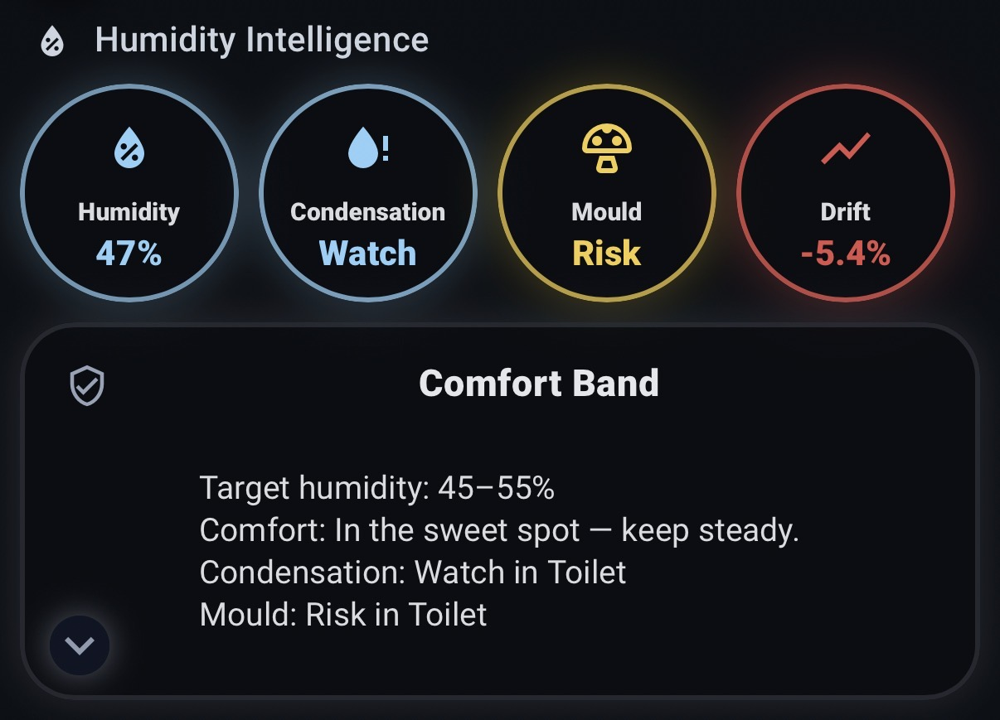

## 🖼️ UI Gallery

Community-contributed Lovelace layouts built on the
Humidity Intelligence public sensor API.

### Available layouts

 ### **DEFAULT UI**
  - Style: 4 badges-first, dropdown-mod, to open humidity constellation
  - Optimised for: Mobile/Tablet
  - Author: @senyo888
  - 
  - [View Expanded UI Preview.png](default-lovelace-ui/default_ui_expanded.png)
  - [Default Dashboard.yaml](default-lovelace-ui/default_dashboard.yaml)
    

---

 ### **Humidity Core For Tablet**
  - Style: Tablet-friendly hero card + alert strips + 24h constellation chart
  - Optimised for: Tablet / wall display
  - Author: @senyo888
  - 
  - [View snapshot (Danger)](humidity-core-tablet-ui/snapshot-danger.png)
  - [Dashboard YAML](humidity-core-tablet-ui/humidity-core-tablet_dashboard.yaml)

---

 ### **HOUSE AVERAGE HUMIDITY BADGE (MOBILE)**
  - Style: Single badge, comfort-band colours (HI backend), risk pulse on Danger
  - Optimised for: Mobile
  - Author: @senyo888
  - 
  - [Badge UI Preview.png](house-average-humidity-badge-mobile-ui/house-average-humidity-badge-mobile.png)
  - [Dashboard YAML](house-average-humidity-badge-mobile-ui/house-average-humidity-badge-mobile_dashboard.yaml)    
