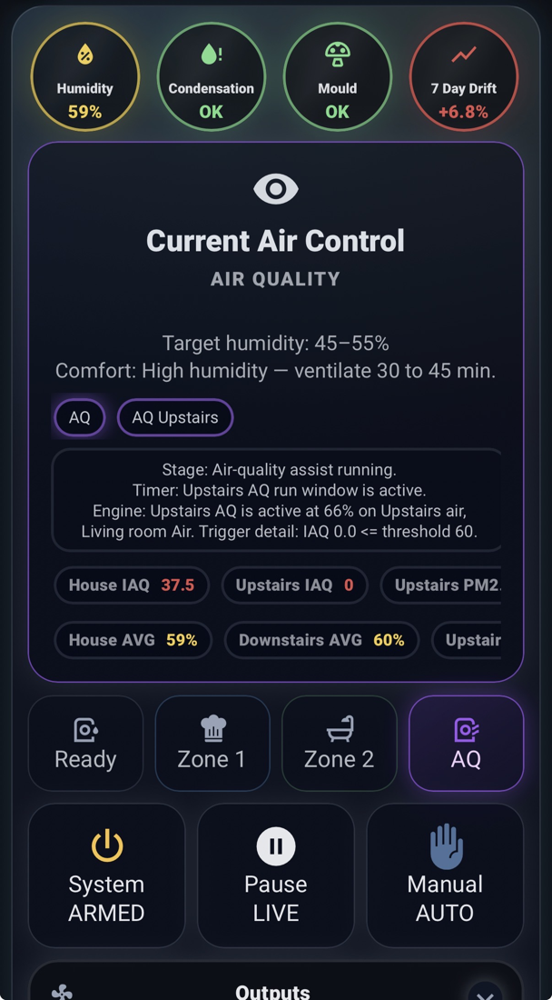
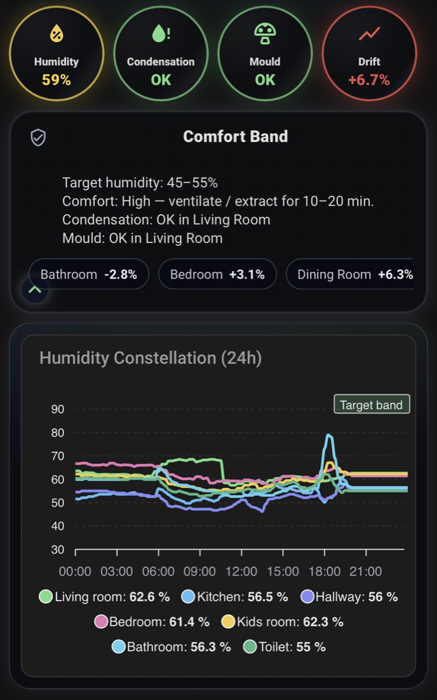

# Humidity Intelligence V2 UI




## Canonical Runtime Presentation Layer

---

## Purpose

The UI exists to render runtime truth.

It must:

- present active lane state
- show gate blocks
- display reason context
- reflect output stage
- mirror engine behavior

It does not:

- compute control logic
- infer lane priority


The engine governs.
The UI reflects.

---

## Included Layouts

- `cards/v2_mobile.yaml`
- `cards/v2_tablet.yaml`
- `cards/v1_mobile.yaml` (legacy-compatible skin)
- `cards/view_cards_button.yaml`

Mobile and tablet share identical control logic.

Difference:

- mobile: rounded top badges
- tablet: squared top badges

Feature parity is maintained.

---

## Deployment Workflow

### Step 1 - Complete Integration Setup First

Finish:

- telemetry
- zones
- humidifiers
- AQ
- alerts
- gates

The UI maps directly to your configuration, and HI notifies you where generated UI YAML is saved.

### Step 2 - Or Generate Cards via Services

Use:

- `humidity_intelligence.create_dashboard`
- `humidity_intelligence.view_cards`
- `humidity_intelligence.dump_cards`

Avoid manual YAML drift.

### Step 3 - After Any Option Change

When modifying:

- sensors
- zones
- alerts
- gates
- slope

Do:

1. save options
2. run `humidity_intelligence.refresh_ui`
3. regenerate cards if required
4. verify Current Air Control panel

---

## Placeholder Mapping Model

`ui/register.py`:

1. builds placeholder to entity map
2. substitutes canonical templates
3. prunes optional rows
4. reports unresolved placeholders

Inventory files:

- `_sensor_ids.txt`
- `_binary_ids.txt`
- `_input_boolean_ids.txt`
- `_timer_ids.txt`

---

## Unresolved Placeholder

Occurs when:

- optional feature not configured
- telemetry missing
- template updated without mapping update

Impact:

- partial card degradation
- diagnostics report the issue

---

## Current Air Control Visual Contract

The panel must:

- match active lane
- reflect gate border color
- display correct chip state
- show readable reason text
- stay synced with real hardware behavior

If mismatch occurs:

- run `humidity_intelligence.refresh_ui`
- re-export cards
- check diagnostics

---

## Legacy v1 UI Support

`v1_mobile.yaml` remains compatible with the V2 engine.

It does not reintroduce:

- v1 backend templates
- v1 packages

Backend must be fully removed before using V2 runtime

---

## UI Preview

### v1 Mobile (Legacy-Compatible Skin)


### v2 Mobile (AQ State Example)


### v2 Tablet (Zone State Example)


---


```

---

## UI PR Checklist

- no stale placeholders
- no hardcoded alert counts
- canonical badge names preserved
- gate border sync maintained
- reason text remains readable

Humidity Intelligence V2 UI a structured runtime interface for a deterministic environmental engine.

